## K210介绍

K210 是基于 RISC-V 精简指令集的一款 MCU，该芯片包含了一个自研的神经网络硬件加速器 KPU 。除了 KPU 的算力优秀之外，K210 芯片还有其他一些特色。

* K210 芯片具有丰富的外设单元，分别是 DVP、JTAG、OTP、FPIOA、GPIO、UART、SPI、RTC、I2S、I2C、WDT、TIMER、PWM，这些外设在实际使用中发挥巨大的作用，基本满足大部分 MCU 外设的需求。
* K210 具有高性能、低功耗的 SRAM，总共 8M，2M 专用于 AI 计算，6M 用于程序；专用外置 FLASH 接口，增加自身的储存空间；数据传输可使用功能强大的 DMA，在数据吞吐能力方面性能优异。

* K210 芯片内部是双核 CPU，指令集为 RISC-V 64 位，每个核心内置独立 FPU，可以单独进行浮点运算。
* 为了更好地在机器视觉和听觉上发挥作用，K210 芯片除了自带计算卷积人工神经网络加速器 KPU，还配有处理麦克风阵列的 APU，能够进行高性能机器视觉和听觉处理。
* K210 还内置快速傅里叶变换加速器，可以进行复数 FFT 计算。
* K210 芯片注重安全，内置了 AES 和 SHA256算法加速器，为用户的数据安全提供有效保障。

下面是K210的芯片架构图：

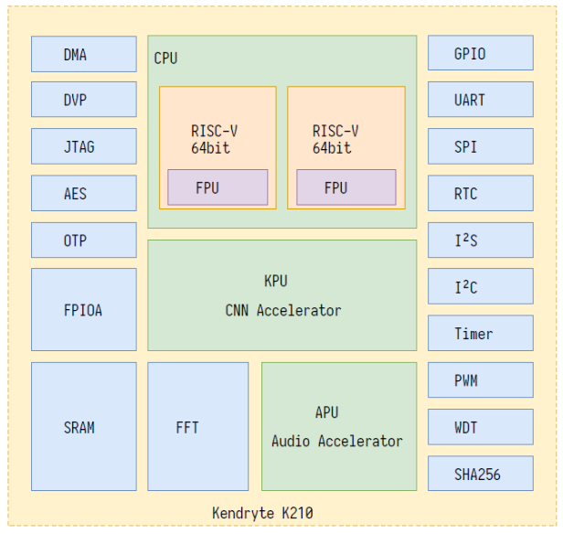

### 一、K210开发套件详解

在AIOT和DIY等领域，K210渐渐流行起来，市场上也出现了各种以K210为核心的嵌入式开发板，对于新手而言，如何从这些纷繁复杂的开发板选择一款适合自己的开发板是比较费劲的。这一节将尽可能地详细列举市面上的常见的K210开发板。

#### 1、亚博智能K210开发板

**该开发板在某宝上售价为299RMB。**

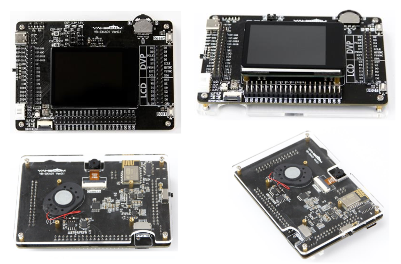

该开发板所拥有的资源如下：

资料来源 https://www.yahboom.com/study/K210-Developer-Kit

##### （1）开发板正面

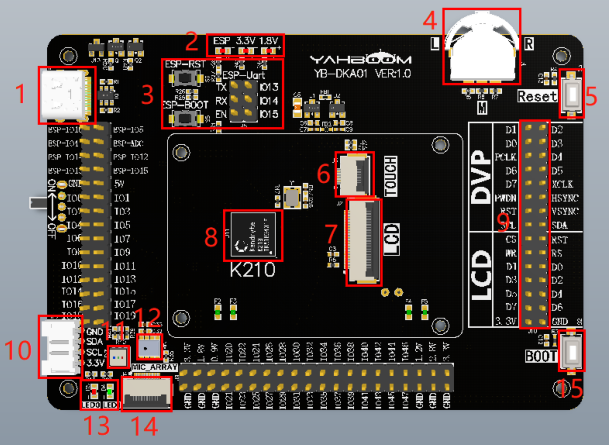

* 1.Type-C 接口：供电、下载固件和串口调试等
* 2.状态指示灯：指示开发板的 3.3V、1.8V 电压是否正常，正常则亮灯。以及 WiFi模块状态
* 3.WiFi 模块串口和按键：可用于烧录 WiFi 模块的固件或者和 K210 串口通讯
* 4.拨轮开关 keypad：三通道拨轮开关
* 5.RESET 键：K210 芯片的复位键
* 6.触摸板接口：用于连接触摸板排线，排线金手指向上
* 7.显示器接口：用于连接显示器排线，排线金手指向上，板载TFT LCD 显示器大小为 2.0 寸，分辨率为 320*240，驱动芯片是 st7789。
* 8.K210 芯片：开发板主芯片，整个板子的核心处理器
* 9.外扩排针：开发板已经把 K210 所有 IO 口引出，可以供外部设备连接使用
* 10.I2C 接口：可外接 I2C 从机设备进行通讯
* 11.RGB 灯：设置三个 IO 口电平，点亮不同颜色
* 12.麦克风：收录声音
* 13.LED 灯：LED0 和 LED1
* 14.麦克风阵列接口：用于连接麦克风阵列
* 15.BOOT 键：也可以作为自定义功能按键使用。

##### （2）开发板背面

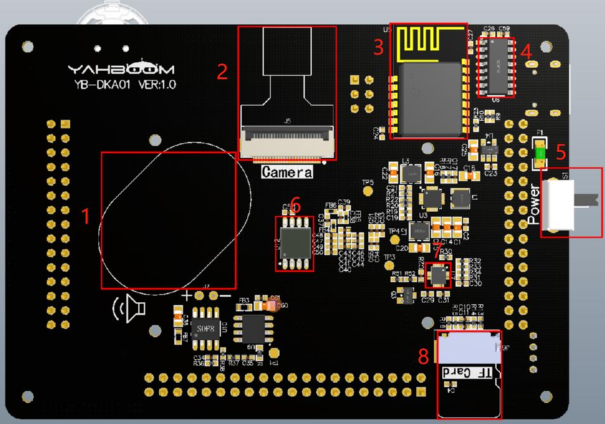

* 1.扬声器：播放声音
* 2.摄像头接口：连接摄像头，板载摄像头型号为ov2640，实际使用30W像素
* 3.WiFi 模块：板载ESP8285-WiFi 模块，可以联网实现 IOT 功能
* 4.CH340 芯片：下载固件和串口调试功能
* 5.电源开关：开发板电源总开关，拨向 ON 为开，拨向 OFF 为关
* 6.flash 芯片：用于保存程序固件和数据
* 7.六轴姿态传感器：板载六轴姿态传感器icm20607，其内部由一个三轴陀螺仪和一个三轴加速度计组成
* 8.TF 卡槽：可插入 TF 卡，金手指朝向开发板。

##### （3）总结

这款K210开发板内部集成了相当丰富的硬件模块，资源丰富。对于该开发板的配套资料，里面有几乎所有模块的使用例程，**全部采用C语言编写**，采用勘智K210的官方SDK。文档非常丰富，但是对于一些模块的介绍稍欠，所以使用者需要想快速上手还需要有一定的嵌入式（单片机）开发经验。

#### 2、SIPEED Maix Go开发板

资料参考 https://cn.maixpy.sipeed.com/zh/develop_kit_board/maix_go.html

SIPEED，即矽速科技是K210芯片的推广者，其攘括市面上绝大多数的K210开发板，后续的开发板介绍也主要是针对该厂商产品。该开发板在某宝上的价格约

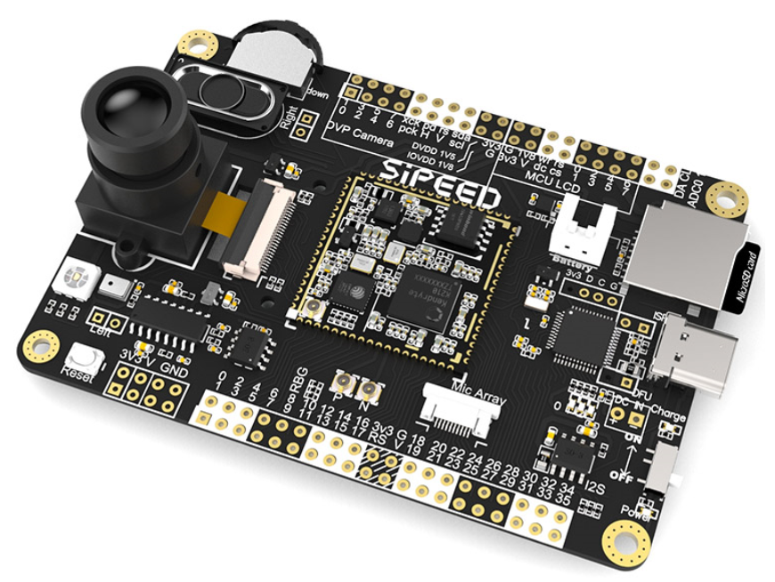

这款开发板是SIPEED所有开发板的集大成者，其内部资源丰富，但是**SIPEED官方已经停止生产该开发板**，所以接下来将简单介绍该开发板的一些资源情况。

* 板载三个普通LED灯
* type C接口
* 麦克风阵列接口
* 板载麦克风
* 板载keypad三通道拨轮开关
* 板载RGB三色灯
* 板载TF Card卡槽
* 板载扬声器
* 板载DVP摄像头接口
* 板载加速度传感器
* 板载ESP8285通信模组

这款开发板的定位和前面的亚博智能K210开发板类似。该开发板SIPEED官方推荐采用MaixPy（Python）开发。

#### 3、SIPEED MaixDock系列开发板

资料参考 https://cn.maixpy.sipeed.com/zh/develop_kit_board/maix_dock.html

MaixDock系列开发板有两种类型，一种是M1W Dock，另一种是M1 Dock，下面将介绍它们之间的异同。

M1W和M1开发板在外观上几乎没有区别：

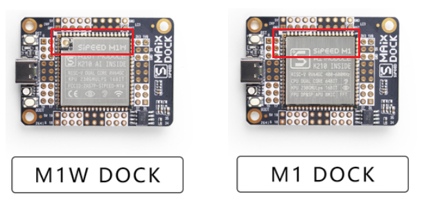

如上图所示，左图的M1W Dock比右边的M1 Dock多了个天线的接口，这便是关键所在，**M1W比M1内部多了一个ESP8285 WIFI模组**。

两块开发板的一些外设资源都很有限，仅提供了如下几个接口：

* SD Card卡槽
* DVP摄像头接口
* TFT LCD接口

其接口功能如下所示：

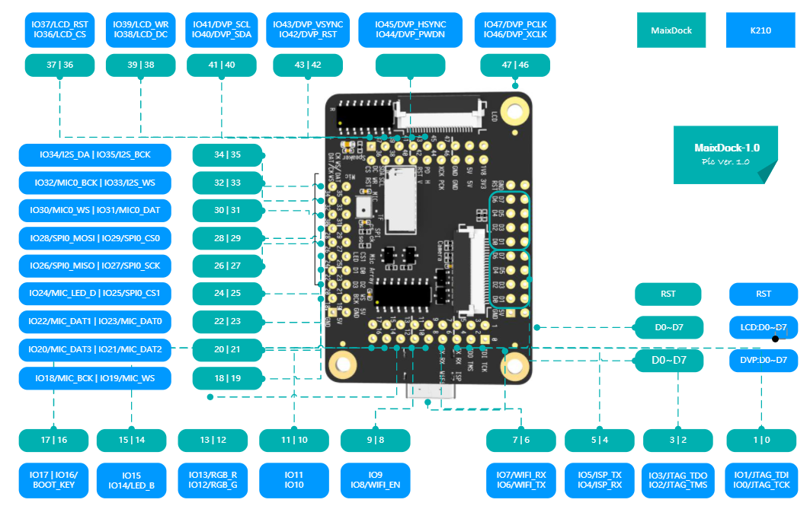

这两款开发板在硬件使用上没有区别，官方推荐使用MaixPy开发，M1W Dock可调用其联网API开发应用。

#### 4、SIPEED MaixDuino开发板

资料参考 https://cn.maixpy.sipeed.com/zh/develop_kit_board/maix_duino.html

这款开发板是最为中规中矩的开发板，你可以认为它是**M1 Dock + ESP32**的结合体，其内部也外加了麦克风和接口。

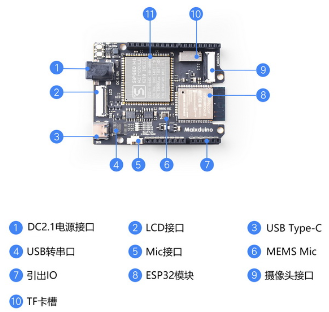

除了一些GIPO以外，该开发板也只提供了如下几个接口：

* SD Card卡槽
* DVP摄像头接口
* TFT LCD接口

该开发板官方推荐采用MaixPy开发，比较有特色的是通过SPI接口引入了ESP32模组。其管脚功能如下所示：

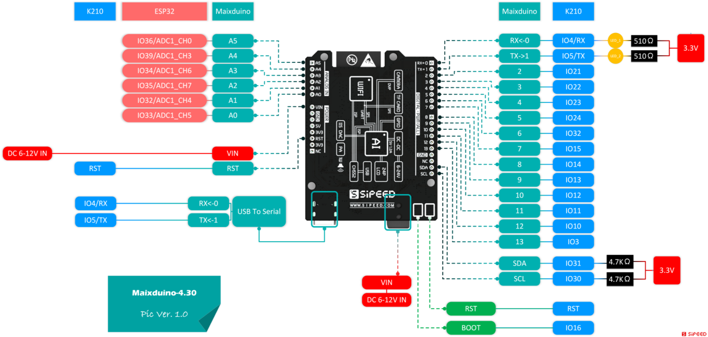

#### 5、SIPEED Maix Bit开发板

资料参考 https://cn.maixpy.sipeed.com/zh/develop_kit_board/maix_bit.html

这款开发板本质上和M1 Dock没有区别。

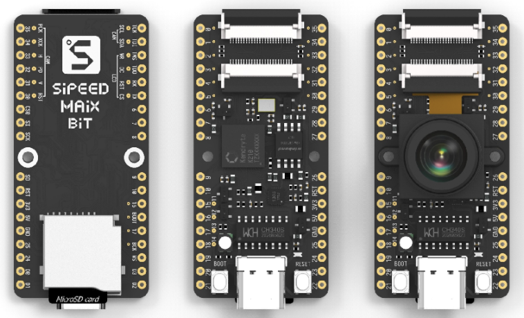

除了一些GIPO以外，该开发板也只提供了如下几个接口：

* SD Card卡槽
* DVP摄像头接口
* TFT LCD接口

其管脚功能如下：

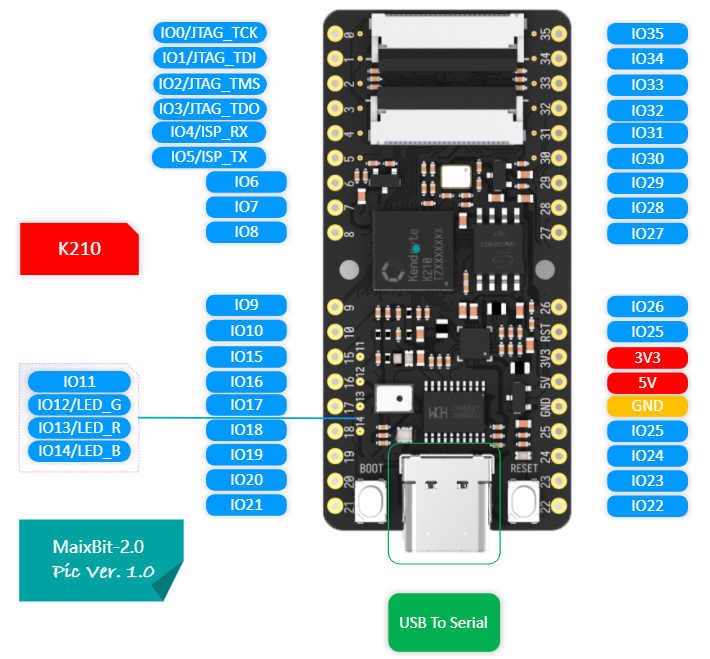

#### 6、SIPEED Maix Nano

资料参考 https://cn.maixpy.sipeed.com/zh/develop_kit_board/maix_nano.html

这可能是最小的K210开发板了。

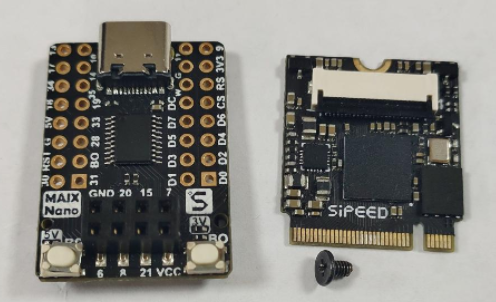

该开发板由金手指和扩展板两个部分组成，可单独购买。该开发板相比于前面的板子资源更加有限，扩展接口只有DVP 摄像头。

### 二、开发板选型

前面罗列了很多款开发板，下面将给出一些选型建议。

* 1、如果是想学习K210内部的硬件资源，想了解配置的细节，想使用勘指的官方SDK开发，首选亚博智能的K210开发板，但使用该开发板前一定要有一定的嵌入式开发经验，新手不推荐使用。
* 2、如果想DIY，推荐使用SIPEED系列开发板，SIPEED系列开发板有官方提供的MaixPy和IDE，上手容易。需要注意的是，其中Maix Go开发板已经停产。
* 3、如果想让开发板具有联网通信能力，推荐使用Maix Dock中的M1W型号开发板和MaixDuino开发板，至于选哪个，看个人情况，价格也有所不同。
* 4、如果想自己DIY，让开发板有更多的自由操作的空间（如自己添加网络或者其他硬件模组），推荐采用Maix Dock的M1型号开发板和Maix Bit开发板，至于选择哪个，看个人情况，价格也有所不同。
* 5、如果只是想使用K210的KPU做图像识别和目标检测任务，推荐Maix Nano开发板。
* 6、SIPEED的板子代码基本上可以互用，例如MaixDuino上的代码几乎可以直接移植到Maix Bit上；亚博智能的板子TFT LCD显示代码和SIPEED有一点不同，但其他的代码几乎可以混用。

### 三、一些推荐的资源和网站

1、勘智K210 SDK：https://github.com/kendryte/kendryte-standalone-sdk

2、勘智K210 SDK使用案例： https://github.com/kendryte/kendryte-standalone-demo

3、MaixPy文档官网：https://cn.maixpy.sipeed.com/zh/

4、YOLOv3在K210中的使用：https://github.com/zhen8838/K210_Yolo_framework

### 四、关于该教程

本教程采用的开发板是亚博智能的K210开发板，使用勘智官方K210 SDK开发。学会了这块板子，其他的SIPEED开发板都可以快速上手掌握，使用MaixPy时也更能得心应手。在使用K210的任何一款开发板之前，建议有使用Arduino/ESP32/8266或者其他嵌入式开发板的经验。

