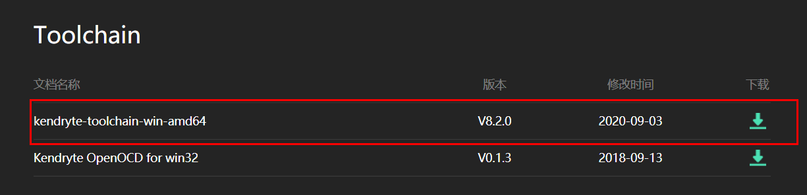
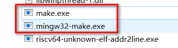
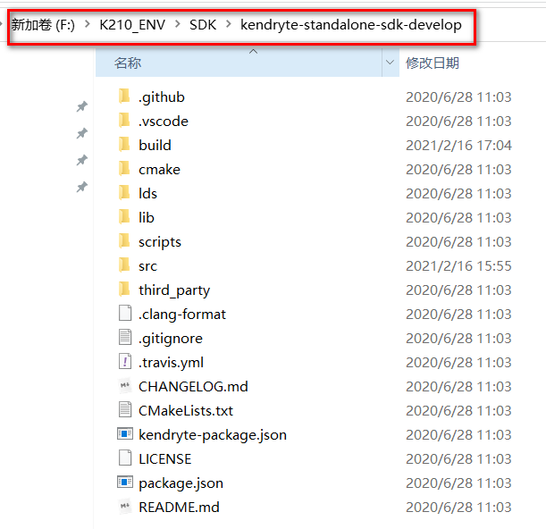
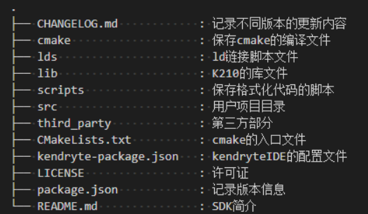
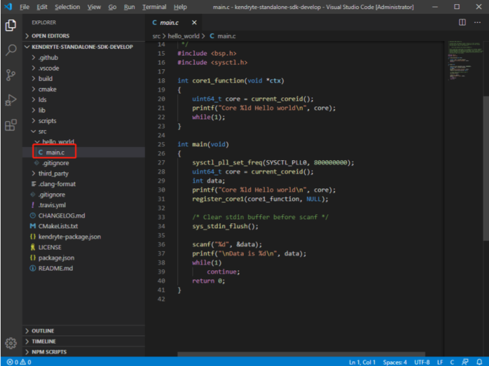
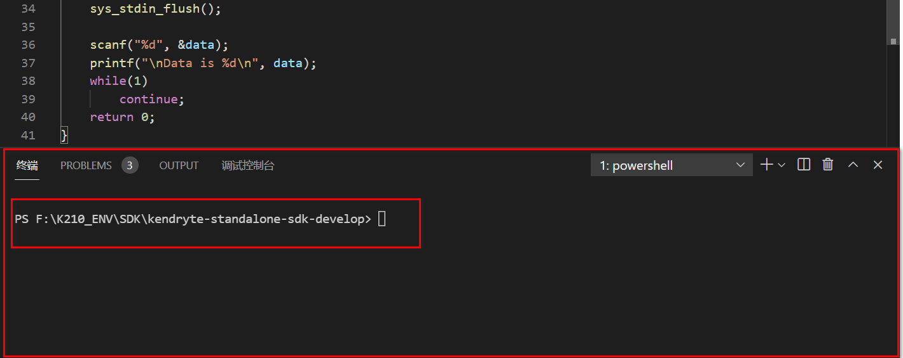
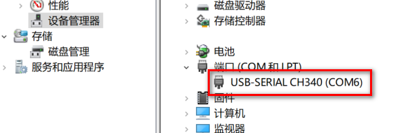
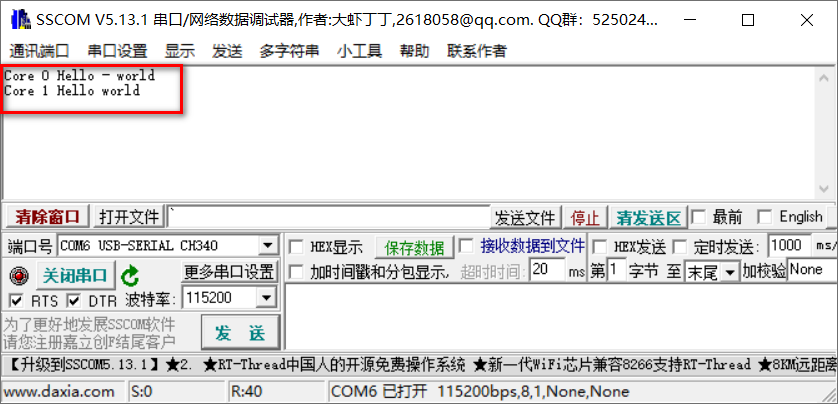

## SDK环境搭建

这里主要针对Windows环境，Linux环境也以此类推。下是环境搭建所需要的工具：

* CMake：CMake 是众多 Make 工具的一种，具有跨平台，跨编译器等特性，是一种非常实用的工具
* Toolchain：交叉编译器 Toolchain 是用于调试开发板的工具和相关库组合起来的工具链
* VSCode：VSCode 是 Microsoft 出品的一款开源代码编辑器，支持多种插件，可扩展性强，具有代码高亮，自动补全等功能
* K210-SDK：K210 官方出的 SDK，是开发 K210 的基础，里面自带有芯片的各种驱动
* kflash：K210 芯片烧录程序的工具

### 一、安装CMake

CMake 的官方下载网址为：https://cmake.org/download/，这里以 win10 64 位系统为例，点击下载 cmake-3.17.2-win64-x64.msi，32 位系统则下载 win32-x86 的版本。

下载后一路解压安装的自定目录，然后打开CMD输入：

```powershell
C:\Users\xxx>cmake -version
cmake version 3.17.2

CMake suite maintained and supported by Kitware (kitware.com/cmake).
```

如果没有出现上面的显示，说明环境变量没有配置好，接下来需要配置环境变量，例如，我的cmake环境变量设置为：

```
D:\K210_ENV\CMake\bin
```

这个环境变量需要根据自己的情况修改。

### 二、安装ToolChain

工具链可以从勘智官网 https://canaan-creative.com/developer 中下载，这里下载的是v8.2.0版本



将压缩包解压到某个目录，例如我这里是 D:\K210_ENV\，然后设置环境变量，我的环境变量设置为：

```powershell
D:\K210_ENV\kendryte-toolchain\bin
```

接下来还需要进入 D:\K210_ENV\kendryte-toolchain\bin 目录，找到 mingw32-make.exe 程序，并且复制粘贴，此时会得到一个叫做 mingw32-make 副本.exe 的文件，然后把mingw32-make 副本.exe 重命名为 make.exe。



然后打开CMD，输入 make -v ，如果出现下面结果则说明安装成功：

```powershell
C:\Users\xxx>make -v
GNU Make 4.2.1
Built for x86_64-w64-mingw32
Copyright (C) 1988-2016 Free Software Foundation, Inc.
License GPLv3+: GNU GPL version 3 or later <http://gnu.org/licenses/gpl.html>
This is free software: you are free to change and redistribute it.
There is NO WARRANTY, to the extent permitted by law.
```

### 三、安装VSCode

这个比较简单，去VSCode官网直接下载安装即可。VSCode 官方下载地址：https://code.visualstudio.com/Download

### 四、下载K210 裸机版SDK

K210 官方提供两个 SDK，一个是裸机版 SDK，另一个是 freertos 系统 SDK，这里以裸机版 SDK 为例。

K210 裸机版 SDK 下载地址：https://github.com/kendryte/kendryte-standalone-sdk

下载完成后解压到某个目录，例如：



该目录中主要的文件介绍如下：



需要注意的是src文件夹，以后如果要创建自己的工程目录，这个目录一定是放在src下的，详细内容会在后续不断说明。

### 五、安装kflash烧写工具

首先安装python3，从Python的官网下载Python3的安装文件，一路安装，安装好之后测试：

```python
C:\Users\xxx>python
Python 3.7.9 (tags/v3.7.9:13c94747c7, Aug 17 2020, 18:58:18) [MSC v.1900 64 bit (AMD64)] on win32
Type "help", "copyright", "credits" or "license" for more information.
>>> 1+2
3
>>> exit()

C:\Users\xxx>pip --version
pip 20.1.1 from d:\program files (x86)\python37\lib\site-packages\pip (python 3.7)
```

接下来通过pip工具安装kflash，在CMD中输入：

```powershell
pip3 install kflash
```

然后测试工具是否安装：

```powershell
C:\Users\jack>kflash --help
usage: kflash [-h] [-p PORT] [-f FLASH] [-b BAUDRATE] [-l BOOTLOADER] [-k KEY]
              [-v] [--verbose] [-t] [-n] [-s]
              [-B {kd233,dan,bit,bit_mic,goE,goD,maixduino,trainer}] [-S]
              firmware
              .....
```

### 六、测试开发环境

使用VSCode打开SDK目录，打开SDK内置的src/hello_world文件夹，如下图所示：



打开VSCode的终端：



在终端中使用命令创建build目录（如果没有该目录）：

```
mkdir build
```

然后进入该目录：

```
cd build
```

此时目录应该切换到：

```
F:\K210_ENV\SDK\kendryte-standalone-sdk-develop\build
```

在终端中输入如下命令编译该hello_world工程：

```powershell
cmake .. -DPROJ=hello_world -G "MinGW Makefiles"
```

命令中的-DPROJ=hello_world指的是需要编译的工程文件夹名。

上面操作结束后输入make命令编译：

```powershell
make
```

编译结束之后会在build目录下找到hello_world.bin这个文件：

```powershell
PS F:\K210_ENV\SDK\kendryte-standalone-sdk-develop\build> ls
....
-a----         2021/6/1     10:21          94144 hello_world.bin
....
```

接下来就是烧写的过程。首先需要将你的开发板（这里是亚博智能K210开发板）接到你的PC上，开机启动，然后打开电脑的设备管理器，找到端口一栏：



我这里是COM6。接下来输入命令，将hello_world.bin文件通过CMO6端口以1500000波特率烧写到K210开发板中：

```powershell
kflash hello_world.bin -p COM6 -b 1500000
```

输出的过程如下：

```powershell
PS F:\K210_ENV\SDK\kendryte-standalone-sdk-develop\build> kflash hello_world.bin -p COM6 -b 1500000
[INFO] COM Port Selected Manually:  COM6 
[INFO] Default baudrate is 115200 , later it may be changed to the value you set. 
[INFO] Trying to Enter the ISP Mode... 
._
[INFO] Automatically detected goE/kd233 

[INFO] Greeting Message Detected, Start Downloading ISP 
Downloading ISP: |========================================================================================| 100.0% 10kiB/s 
[INFO] Booting From 0x80000000 
[INFO] Wait For 0.1 second for ISP to Boot 
[INFO] Boot to Flashmode Successfully 
[INFO] Selected Baudrate:  1500000 
[INFO] Baudrate changed, greeting with ISP again ...  
[INFO] Boot to Flashmode Successfully 
[INFO] Selected Flash:  On-Board 
[INFO] Initialization flash Successfully 
Programming BIN: |========================================================================================| 100.0% 60kiB/s 
[INFO] Rebooting... 
```

打开串口调试工具，打开该COM6端口，可以看到：



至此，开发环境搭建成功。