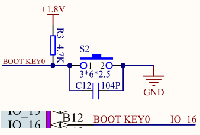
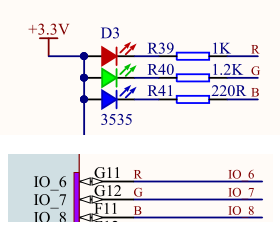
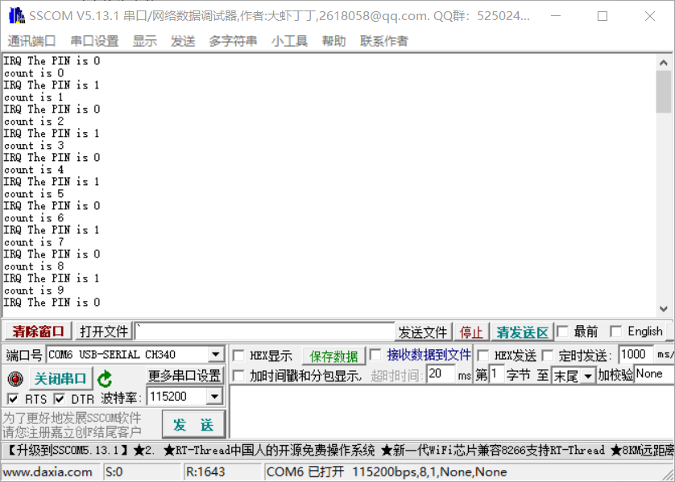

## 外部中断

实验的代码可见src/button。

在上一章中，我们通过不断轮询Keypad的按键状态来判断案件是否按下，所有的按键检测程序都是在一个while循环中，除此之外，为了防止按键抖动还采用了msleep休眠方式，这样程序很容易跑满整个CPU，效率较低。

基于上述问题，这里引入外部中断。由于按键按下和松开都伴随着电平的变化，这里称之为“上升沿触发”和“下降沿触发”。只要IO口能捕获到这两种触发，那么可以让CPU停下来去处理按键事件，这个过程是异步的，因为程序无需主动、循环检测按键状态变化，采用外部中断方式可以让K210自动告诉你按键是否按下或者松开，CPU可以去做其他的事，而不是在while循环中空等待。

接下来就通过一个独立按键点亮小灯的实验来说明如何使用K210的外部中断功能。

开发板中的独立按键电路原理图入下所示：



RGB灯的电路原理图如下所示：



现在的需求是，通过该独立按键来控制R灯的亮灭。

实验的IO口配置如下：

```c
#ifndef _PIN_CONFIG_H_
#define _PIN_CONFIG_H_
/*****************************HEAR-FILE************************************/
#include "fpioa.h"

/*****************************HARDWARE-PIN*********************************/
// 硬件IO口，与原理图对应
#define PIN_RGB_R             (6)

#define PIN_KEY               (16)

/*****************************SOFTWARE-GPIO********************************/
// 软件GPIO口，与程序对应
#define RGB_R_GPIONUM          (0)

#define KEY_GPIONUM            (6)

/*****************************FUNC-GPIO************************************/
// GPIO口的功能，绑定到硬件IO口
#define FUNC_RGB_R             (FUNC_GPIOHS0 + RGB_R_GPIONUM)

#define FUNC_KEY               (FUNC_GPIOHS0 + KEY_GPIONUM)

#endif /* _PIN_CONFIG_H_ */
```

LED的设置和初始化就不再累述，直接看KEY的设置：

```c
void init_key(void)
{
    /* 设置按键的GPIO模式为上拉输入 */
    gpiohs_set_drive_mode(KEY_GPIONUM, GPIO_DM_INPUT_PULL_UP);
    /* 设置按键的GPIO电平触发模式为上升沿和下降沿 */
    gpiohs_set_pin_edge(KEY_GPIONUM, GPIO_PE_BOTH);
    /* 设置按键GPIO口的中断回调 */
    gpiohs_irq_register(KEY_GPIONUM, 1, key_irq_cb, &g_count);
}
```

首先设置按键接口为上拉输入，输入非常好理解，至于上拉，可以参考电路原理图，按键未接同时和1.8v电压相连。然后设置按键中断的触发条件时边缘触发，设置为GPIO_PE_BOTH意味着上升沿和下降沿都会触发中断，其他的触发条件有：

```c
typedef enum _gpio_pin_edge
{
    GPIO_PE_NONE,
    GPIO_PE_FALLING,
    GPIO_PE_RISING,
    GPIO_PE_BOTH,
    GPIO_PE_LOW,
    GPIO_PE_HIGH = 8,
} gpio_pin_edge_t;
```

最后是设置中断触发的回调函数，当发生中断时应该去处理的函数。gpiohs_irq_register函数的原型如下：

```c
void gpiohs_irq_register(uint8_t pin, uint32_t priority, plic_irq_callback_t callback, void *ctx)
```

* 参数1为按键的功能IO口编号
* 参数2为中断的优先级，数字越小，优先级越高
* 参数3为中断回调函数
* 参数4为需要传入中断回调函数的参数

在本次实验中，中断回调函数为key_irq_cb，传入参数为g_count，该参数用于统计按键按下的次数。对于中断回调函数的类型plic_irq_callback_t定义如下：

```c
typedef int (*plic_irq_callback_t)(void *ctx);
```

该函数传入值类型为void*，返回值为int，实验中使用的key_irq_cb定义如下：

```c
int key_irq_cb(void* ctx)
{
    gpio_pin_value_t key_state = gpiohs_get_pin(KEY_GPIONUM);
    /* 这里只是为了测试才在中断回调打印数据，正常情况下是不建议这么做的。*/
    printf("IRQ The PIN is %d\n", key_state);

    uint32_t *tmp = (uint32_t *)(ctx);
    printf("count is %d\n", (*tmp)++);

    if (!key_state)
        gpiohs_set_pin(RGB_R_GPIONUM, GPIO_PV_LOW);
    else
        gpiohs_set_pin(RGB_R_GPIONUM, GPIO_PV_HIGH);
    return 0;
}
```

在该函数中使用了printf函数，使用过C语言的同学对这个函数应该非常熟悉，这个函数是勘智官方提供的一个打印函数，可以直接往串口中写入数据。

key_irq_cb会读取和打印按键当前处于的状态，并统计按键按下和松开的次数，轮流让R灯亮和灭。顺带一提，中断回调函数中不大建议做一些耗时的操作，由于中断会打断CPU的节奏，停止CPU正在执行的任务而去处理中断回调函数，所以如果中断回调函数里有较耗时操作，其他任务将无法得到CPU的执行权。

有了上面的基础后，程序的主函数定义如下：

```c
int main(void)
{
    // 硬件引脚初始化
    hardware_init();

    /* 外部中断初始化 */
    plic_init();
    /* 使能全局中断 */
    sysctl_enable_irq();

    // 初始化RGB灯
    init_rgb();

    // 初始化按键key
    init_key();
    
    while (1);
    return 0;
}
```

主函数卡在while(1)处，并没有继续循环执行其他任务（如按键检测），一旦有按键按下或者松开，程序将跳转到key_irq_cb函数中执行任务。

最后在build目录下通过如下命令编译和烧写程序到开发板中：

```c
cmake .. -DPROJ=button -G "MinGW Makefiles"
make
kflash .\button.bin -p COM6 -b 1500000
```

随着按键的按下和松开，R灯不断亮灭，串口打印的信息如下：




