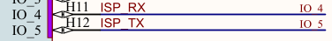
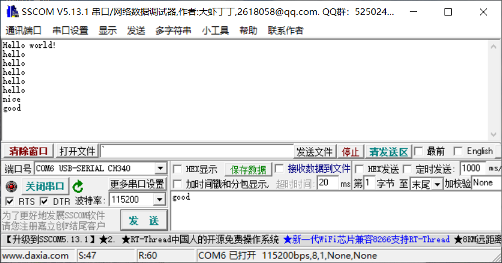
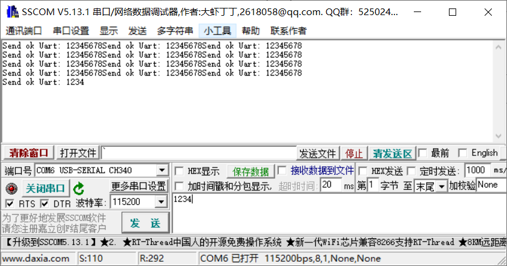

## 串行通信

开发板上采用了TypeC接口和电脑连接，在之前的实验中也是通过该接口来下载程序到开发板。有过单片机使用经验的同学都使用过USB转串口（如CH340），一般而言，开发板上的USB接口都会和该USB转串口芯片相连接。在开发板上，TypeC接口和CH340 USB转串口芯片连接，在前面的外部中断实验中也使用过串口助手读取K210打印的信息。

UART是通用异步收发传输器（Universal Asynchronous Receiver/Transmitter）。K210提供了四个UART串行通信接口，其中有三个是通用UART（UART1、UART2和UART3），一个高速UARTHS（UART0）。

通用UART支持异步通信（RS232和RS485和IRDA），通信速率可达到5Mbps，支持CTS和RTS信号的硬件管理以及软件流控(XON和XOFF)。3个接口均可被DMA访问或者CPU直接访问，每次传输数据为8字节，支持异步时钟，可单独配置数据时钟，实现全双工模式，保证两个时钟域中数据同步。UART默认为RS232模式，也可以配置为软件可编程式RS485模式。支持用THRE中断模式来提升串口性能。当THRE模式和FIFO模式被选择之后，如果FIFO数据中少于阈值便触发THRE中断。高速UART通讯速率可达到5Mbps，拥有8字节发送和接收FIFO，可编程式THRE中断，不支持硬件流控制或者其他调制解调器控制信号或同步串行数据转换器。K210提供的的printf调试函数默认就是调用UARTHS串口来实现数据收发的。

K210串口通信的输入和输出可以映射到各个端口上，使用非常灵活方便，在本部分将详细介绍K210的串口通信资源。

开发板上的USB转串口芯片CH340和K210的连接如下图所示：


### 一、普通UART通信

这部分实验主要演示最基本的UART数据收发功能，实验代码可见src/uart。

硬件接口配置如下所示：

```c
#ifndef _PIN_CONFIG_H_
#define _PIN_CONFIG_H_
/*****************************HEAR-FILE************************************/
#include "fpioa.h"
#include "uart.h"

/*****************************HARDWARE-PIN*********************************/
// 硬件IO口，与原理图对应
#define PIN_UART_USB_RX       (4)
#define PIN_UART_USB_TX       (5)

/*****************************SOFTWARE-GPIO********************************/
// 软件GPIO口，与程序对应
#define UART_USB_NUM           UART_DEVICE_1

/*****************************FUNC-GPIO************************************/
// GPIO口的功能，绑定到硬件IO口
#define FUNC_UART_USB_RX       (FUNC_UART1_RX + UART_USB_NUM * 2)
#define FUNC_UART_USB_TX       (FUNC_UART1_TX + UART_USB_NUM * 2)

#endif /* _PIN_CONFIG_H_ */
```

首先，需要注意的是UART_USB_NUM，其值为UART_DEVICE_1，选择的是UART1，当然还有其它选择：

```c
typedef enum _uart_device_number
{
    UART_DEVICE_1,
    UART_DEVICE_2,
    UART_DEVICE_3,
    UART_DEVICE_MAX,
} uart_device_number_t;
```

K210支持三个普通UART和一个高速UART。

接下来是

```c
#define FUNC_UART_USB_RX       (FUNC_UART1_RX + UART_USB_NUM * 2)
#define FUNC_UART_USB_TX       (FUNC_UART1_TX + UART_USB_NUM * 2)
```

其中 有 FUNC_UART1_RX + UART_USB_NUM * 2 ，这个设置有点奇怪，里面有个*2，于是观察源码：

```c
FUNC_UART1_RX         = 64, /*!< UART1 Receiver */
FUNC_UART1_TX         = 65, /*!< UART1 Transmitter */
FUNC_UART2_RX         = 66, /*!< UART2 Receiver */
FUNC_UART2_TX         = 67, /*!< UART2 Transmitter */
FUNC_UART3_RX         = 68, /*!< UART3 Receiver */
FUNC_UART3_TX         = 69, /*!< UART3 Transmitter */
```

这就很好理解了，UART_DEVICE_1是个枚举值，其值为0，如果选择UART_DEVICE_1，那么FUNC_UART_USB_RX和FUNC_UART_USB_TX分别选择的是FUNC_UART1_RX和FUNC_UART1_TX功能端口，UART_DEVICE_2和其他的也以此类推。

有了前面的管脚设置之后，将物理管脚和功能管脚绑定：

```c
void hardware_init(void)
{
    // fpioa映射
    fpioa_set_function(PIN_UART_USB_RX, FUNC_UART_USB_RX);
    fpioa_set_function(PIN_UART_USB_TX, FUNC_UART_USB_TX);
}
```

紧接着配置UART的功能：

```c
hardware_init();
// 初始化串口3，设置波特率为115200
uart_init(UART_USB_NUM);
uart_configure(UART_USB_NUM, 115200, UART_BITWIDTH_8BIT, UART_STOP_1, UART_PARITY_NONE);
```

uart_init函数需要传入一个UART的通道，uart_configure的函数原型如下所示：

```c
void uart_configure(uart_device_number_t channel, uint32_t baud_rate, uart_bitwidth_t data_width, uart_stopbit_t stopbit, uart_parity_t parity)
```

* 参数1为UART通道号，这里设置为UART_DEVICE_1
* 参数2为波特率，这里设置为115200
* 参数3位数据位宽，这里为8位
* 参数4为停止位个数，这里为一位停止位
* 参数5为优先级，这里不设置优先级

上述的配置也是较为常用的UART配置，以后的UART配置也基本上是这个。

主程序代码逻辑如下：

```c
int main(void)
{
    hardware_init();
    // 初始化串口3，设置波特率为115200
    uart_init(UART_USB_NUM);
    uart_configure(UART_USB_NUM, 115200, UART_BITWIDTH_8BIT, UART_STOP_1, UART_PARITY_NONE);

    /* Hello world! */
    char *hello = {"Hello world!\n"};
    uart_send_data(UART_USB_NUM, hello, strlen(hello));

    char recv = 0;

    while (1)
    {
        /* 等待串口信息，并通过串口发送出去 */
        while(uart_receive_data(UART_USB_NUM, &recv, 1))
        {
            uart_send_data(UART_USB_NUM, &recv, 1);
        }
    }
    return 0;
}
```

除去UART的配置，主程序中先调用了uart_send_data函数向串口接收端（这里是PC）发送了一串字符串，uart_send_data函数的原型如下：

```c
int uart_send_data(uart_device_number_t channel, const char *buffer, size_t buf_len)
```

参数一为UART的通道，参数二位发送字符缓冲区地址，参数三位发送字符长度。

然后在一个while循环中不断调用uart_receive_data接收PC端发送过来的字符，每次只接收一个字符，接收后将该字符原封不动返回给发送端，其中uart_receive_data函数原型如下：

```c
int uart_receive_data(uart_device_number_t channel, char *buffer, size_t buf_len)
```

其参数类型和uart_send_data类似，不再过多介绍。

有了前面的基础之后，在build目录下通过执行以下命令编译烧写代码到开发板中：

```c
cmake .. -DPROJ=uart -G "MinGW Makefiles"
make
kflash .\uart.bin -p COM6 -b 1500000
```

通过串口工具向K210发送数据，串口工具显示如下：



### 二、UART中断

上面介绍的案例中，UART在一个while循环中接收数据，一次接收一个字符，这样做效率不高，和前面的外部中断一样，UART也支持异步方式接收数据，下面这个案例将详细介绍如何使用K210 SDK的UART异步中断编程。实验代码可见src/uart_int。

首先是配置文件，配置文件的内容和上一章的内容几乎完全一样。接下来需要配置IO映射、初始化全局中断和配置UART，这部分的代码比较固定：

```c
hardware_init();
plic_init();
sysctl_enable_irq();

uart_init(UART_NUM);
uart_configure(UART_NUM, 115200, 8, UART_STOP_1, UART_PARITY_NONE);
```

下面是设置UART中断配置代码：

```c
uart_set_receive_trigger(UART_NUM, UART_RECEIVE_FIFO_8);
uart_irq_register(UART_NUM, UART_RECEIVE, on_uart_recv, NULL, 2);
```

uart_set_receive_trigger函数负责设置UART通道的接收缓冲区长度，这里设置接收缓冲区长度为8个字节，换言之，UART一次只能接收8个字节的数据：

```c
typedef enum _uart_receive_trigger
{
    UART_RECEIVE_FIFO_1,
    UART_RECEIVE_FIFO_4,
    UART_RECEIVE_FIFO_8,
    UART_RECEIVE_FIFO_14,
} uart_receive_trigger_t;
```

缓冲区一次最多可接收14字节数据。

接下来是uart_irq_register函数，该函数原型如下：

```c
void uart_irq_register(uart_device_number_t channel, uart_interrupt_mode_t interrupt_mode, plic_irq_callback_t uart_callback, void *ctx, uint32_t priority)
```

* 参数1为UART的通道号
* 参数2为中断触发模式，可选择 UART_SEND和UART_RECEIVE
* 参数3为中断回调函数
* 参数4为传入中断回调函数的参数
* 参数5为终端优先级

这里设置的中断回调函数为on_uart_recv，该函数定义如下：

```c
int on_uart_recv(void *ctx)
{
    char v_buf[12];
    int ret =  uart_receive_data(UART_NUM, v_buf, 12);
    char *v_send_ok = "Send ok Uart: ";
    // printf("receive %s\n", v_buf);
    uart_send_data(UART_NUM, v_send_ok,strlen(v_send_ok));
    uart_send_data(UART_NUM, v_buf, ret);
    return 0;
}
```

由于uart_set_receive_trigger设置了接收缓冲区长度为8bytes，所以每接收8bytes数据将触发一次中断。在该回调函数中会接收8bytes数据，然后将数据返回发送端，虽然用户接收缓冲区大小为12字节，但UART缓冲区中一次最多只能是8bytes。

通过一下命令编译烧写程序到开发板中：

```c
cmake .. -DPROJ=uart_int -G "MinGW Makefiles"
make
kflash .\uart_int.bin -p COM6 -b 1500000
```

实验现象如下：




### 三、UART DMA中断

这部分内容在学习K210 DMA之后会介绍，这是一种更加高效的UART方式。