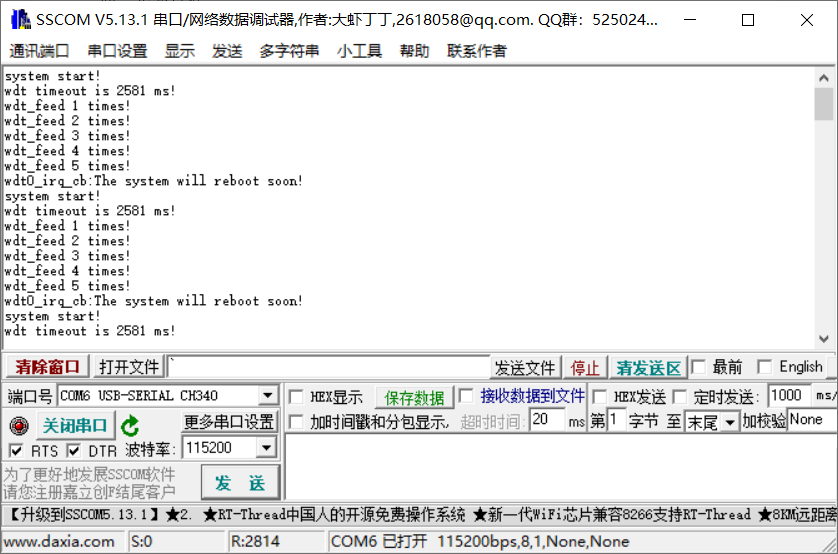
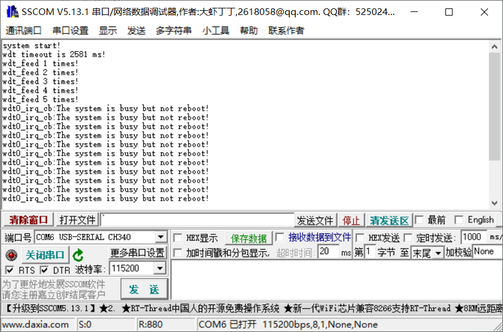

## 看门狗

看门狗定时器（WDT，Watch Dog Timer）是单片机的一个组成部分，它实际上是一个计数器，一般给看门狗一个数字，程序开始运行后看门狗开始倒计数。如果程序运行正常，过一段时间CPU应发出指令让看门狗复位，重新开始倒计数。如果看门狗减到0 就认为程序没有正常工作，强制整个系统复位。

 当嵌入式系统运行时受到外部干扰或者系统错误，程序有时会出现"跑飞"，导致整个系统瘫痪。为了防止这一现象的发生，在对系统稳定性要求较高的场合往往要加入看门狗(WATCHDOG)电路。看门狗的作用就是当系统“跑飞”而进入死循环时，恢复系统的运行。举个例子，假如嵌入式程序在一个while循环中不断执行，然而因为某个原因，在while循环中执行的某个任务或者函数出现了异常，这个异常导致程序卡死在这个异常位置，无法跳出继续运行。这时候看门狗作用就体现出来，看门狗可以理解为可以让程序定期向一个位置写入数据（喂狗），如果超出一定时间程序没有向该位置写入数据，那么可以认为程序中出现了异常，卡死在某个位置，这时候看门狗因为没有数据写入，就开始发狂，这时候会触发“被狗咬”事件，程序员需要处理这个事件。对于“被狗咬”事件，程序员可以选择让系统重启，也可以选择其他补救做法。这便是看门狗作用：防止程序卡死或者跑飞。

K210中提供了两个看门狗定时器，该章实验将介绍如何使用K210的看门狗定时器，实验代码详见src/watchdog。

首先是全局的中断初始化操作：

```c
/* 打印系统启动信息 */
printf("system start!\n");

/* 系统中断初始化 */
plic_init();
sysctl_enable_irq();
```

在程序一开始便打印了系统的启动信息，接着初始化全局中断。

紧接着，程序初始化看门狗：

```c
/* 启动看门狗，设置超时时间为2秒后调用中断函数wdt0_irq_cb */
int timeout = wdt_init(WDT_DEVICE_0, 2000, wdt0_irq_cb, NULL);

/* 打印看门狗实际超时的时间 */
printf("wdt timeout is %d ms!\n", timeout);
```

看门狗初始化函数wdt_init定义如下：

```c
uint32_t wdt_init(wdt_device_number_t id, uint64_t time_out_ms, plic_irq_callback_t on_irq, void *ctx)
```

* 参数1为看门狗的设备号，有两个可供选择，本次实验选择WDT_DEVICE_0：

  ```c
  typedef enum _wdt_device_number
  {
      WDT_DEVICE_0,
      WDT_DEVICE_1,
      WDT_DEVICE_MAX,
  } wdt_device_number_t;
  ```

* 参数2为超时时间，设置该时间后，应该在该时间范围内“喂狗”，否则超时触发中断（被狗咬）。
* 参数3为看门狗超时中断回调函数。
* 参数4为中断回调函数传入参数

函数的返回值为实际超时时间，这与初始化设置的时间可能会有所差异。

看门狗回调函数wdt0_irq_cb定义如下：

```c
#define WDT_TIMEOUT_REBOOT    1

int wdt0_irq_cb(void *ctx)
{
    #if WDT_TIMEOUT_REBOOT
    printf("%s:The system will reboot soon!\n", __func__);
    while(1);
    #else
    printf("%s:The system is busy but not reboot!\n", __func__);
    wdt_clear_interrupt(WDT_DEVICE_0);
    #endif
    return 0;
}
```

这里设置了一个宏WDT_TIMEOUT_REBOOT，启用该宏表示啥也不做，看门狗将直接让系统重启；如果设置为0，那么将清除看门狗定时器中断，程序不会重启。

有了上面的准备工作后，接下来就是实验的主要部分：

```c
/* 记录feed的次数 */
int times = 0;

while(1)
{
    sleep(1);
    if(times++ < 5)
    {
        /* 打印feed的次数 */
        printf("wdt_feed %d times!\n", times);

        /* 重置看门狗的计时器，重新开始计时 */
        wdt_feed(WDT_DEVICE_0);
    }
}
```

这里定义了一个times变量来统计喂狗次数。实验中在一个while循环中没过1s“喂狗”一次，但是只连续“喂狗”5次，五次之后观察看门狗是否会超时，系统是否会重启。

通过如下命令编译烧写代码到开发板中：

```c
cmake .. -DPROJ=watchdog -G "MinGW Makefiles"
make
kflash .\watchdog.bin -p COM6 -b 1500000
```

串口输出信息如下：



从实验结果可以看出，如果不“喂狗”，系统默认会重启。

之前将WDT_TIMEOUT_REBOOT设置为1，接下来测试WDT_TIMEOUT_REBOOT设置为0时会发生什么现象：



看门狗定时器超时执行代码为：

```c
printf("%s:The system is busy but not reboot!\n", __func__);
wdt_clear_interrupt(WDT_DEVICE_0);
```

这里使用了wdt_clear_interrupt来清除看门狗定时器的中断位，清除该位之后，看门狗不会将系统重启，但会一直超时并不断触发中断回调函数。

