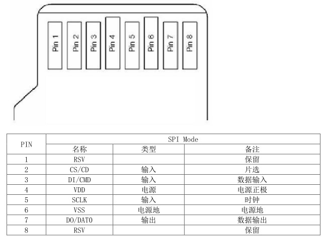
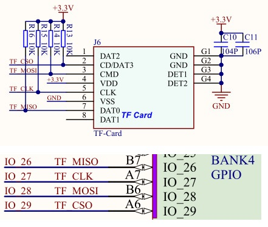

## 读写SD卡

本次实验代码详见src/sdcard。

TF 有 4 个数据传输端：DAT0、DAT1、DAT2、DAT3和一个 CMD 脚，用来读取卡内信息。TF 卡主要管脚的功能：

* CLK：时钟信号，每个时钟周期传输一个命令或数据位，频率可在 0～25MHz之间变化，TF 卡的总线管理器可以不受任何限制的自由产生 0～25MHz 的频率。
* CMD：双向命令和回复线，命令是主机到从卡操作的开始，命令可以是从主机到单卡寻址，也可以是到所有卡；回复是对之前命令的回答，回复可以来自单
  卡或所有卡。
* DAT0～3：数据线，数据可以从 TF 卡传向主机也可以从主机传向 TF 卡。

TF 卡传输数据一般有两种模式，SD 模式和 SPI 模式，这里我们以 SPI 模式的方式传输数据。SPI 模式引脚如下：1：CS，2：DI，3：VSS，4：VDD，5：SCLK，
6：VSS2，7：DO，8：RSV，9：RSV。



K210 开发板出厂默认已经焊接 TF 卡槽，需要插入 TF 卡才可以使用，其中TF卡槽的TF_MISO连接到IO26，TF_CLK连接到IO27，TF_MOSI连接到IO28，TF_CSO
连接 IO29。



K210开发板通过SPI总线和TF卡连接，所以会用到SPI总线库。

在实验代码部分的src/sdcard/sdcard文件夹下是一些关于TF卡的驱动文件，感兴趣的同学可以深入研究。

接下来是实验代码的解读，首先是IO口配置：

```c
#ifndef _PIN_CONFIG_H_
#define _PIN_CONFIG_H_
/*****************************HEAR-FILE************************************/
#include "fpioa.h"

/*****************************HARDWARE-PIN*********************************/
// 硬件IO口，与原理图对应
#define PIN_TF_MISO            (26)
#define PIN_TF_CLK             (27)
#define PIN_TF_MOSI            (28)
#define PIN_TF_CS              (29)

/*****************************SOFTWARE-GPIO********************************/
// 软件GPIO口，与程序对应
#define TF_CS_GPIONUM          (2)

/*****************************FUNC-GPIO************************************/
// GPIO口的功能，绑定到硬件IO口
#define FUNC_TF_SPI_MISO        (FUNC_SPI1_D1)
#define FUNC_TF_SPI_CLK         (FUNC_SPI1_SCLK)
#define FUNC_TF_SPI_MOSI        (FUNC_SPI1_D0)
#define FUNC_TF_SPI_CS          (FUNC_GPIOHS0 + TF_CS_GPIONUM)

#endif /* _PIN_CONFIG_H_ */
```

本次实验采取了SPI1功能。

接下来是初始化硬件管脚映射和设置系统时钟频率，这部分内容相对固定：

```c
// 硬件引脚初始化
hardware_init();

/* 设置系统时钟频率 */
sysctl_pll_set_freq(SYSCTL_PLL0, 800000000UL);
sysctl_pll_set_freq(SYSCTL_PLL1, 300000000UL);
sysctl_pll_set_freq(SYSCTL_PLL2, 45158400UL);
```

首先检查SD卡：

```c
if (check_sdcard())
{
    printf("SD card err\n");
    return -1;
}
```

该函数定义如下：

```c
static int check_sdcard(void)
{
    uint8_t status;

    printf("/******************check_sdcard*****************/\n");
    status = sd_init();
    printf("sd init :%d\n", status);
    if (status != 0)
    {
        return status;
    }

    printf("CardCapacity:%.1fG \n", (double)cardinfo.CardCapacity / 1024 / 1024 / 1024);
    printf("CardBlockSize:%d\n", cardinfo.CardBlockSize);
    return 0;
}
```

在该函数中调用sd_init函数来判断卡槽中的SD卡状态，如果SD卡存在则返回0，否则返回1。如果SD卡存在，则打印SD卡的容量和每个读写块的大小。

然后检查SD卡中是否存在FAT32文件系统：

```c
if (check_fat32())
{
    printf("FAT32 err\n");
    return -1;
}
```

check_fat32函数定义如下：

```c
static int check_fat32(void)
{
    static FATFS sdcard_fs;
    FRESULT status;
    DIR dj;
    FILINFO fno;

    printf("/********************check_fat32*******************/\n");
    status = f_mount(&sdcard_fs, _T("0:"), 1);
    printf("mount sdcard:%d\n", status);
    if (status != FR_OK)
        return status;

    printf("printf filename\n");
    status = f_findfirst(&dj, &fno, _T("0:"), _T("*"));
    while (status == FR_OK && fno.fname[0])
    {
        if (fno.fattrib & AM_DIR)
            printf("dir:%s\n", fno.fname);
        else
            printf("file:%s\n", fno.fname);
        status = f_findnext(&dj, &fno);
    }
    f_closedir(&dj);
    return 0;
}
```

在该函数中，首先调用f_mount函数挂载SD卡中的文件系统，然后调用f_findfirst函数获取根目录文件信息，将根目录下的文件夹和文件全部打印出来。check_fat32函数中用到的SD卡操作相关函数原型如下：

```c
FRESULT f_mount (
	FATFS* fs,			/* Pointer to the file system object (NULL:unmount)*/
	const TCHAR* path,	/* Logical drive number to be mounted/unmounted */
	BYTE opt			/* Mode option 0:Do not mount (delayed mount), 1:Mount immediately */
);

FRESULT f_findfirst (
	DIR* dp,				/* Pointer to the blank directory object */
	FILINFO* fno,			/* Pointer to the file information structure */
	const TCHAR* path,		/* Pointer to the directory to open */
	const TCHAR* pattern	/* Pointer to the matching pattern */
);

FRESULT f_findnext (
	DIR* dp,		/* Pointer to the open directory object */
	FILINFO* fno	/* Pointer to the file information structure */
);

FRESULT f_closedir (
	DIR *dp		/* Pointer to the directory object to be closed */
)
```

在检查并挂载完SD卡之后，向SD卡中的一个文件写入内容：

```c
sleep(1);
if (sd_write_file(_T("test.txt")))
{
    printf("SD write err\n");
    return -1;
}
```

sd_write_file函数定义如下：

```c
FRESULT sd_write_file(TCHAR *path)
{
    FIL file;
    FRESULT ret = FR_OK;
    printf("/*******************sd_write_file*******************/\n");
    uint32_t v_ret_len = 0;

    /* 打开文件，如果文件不存在，则新建 */
    if ((ret = f_open(&file, path, FA_CREATE_ALWAYS | FA_WRITE)) != FR_OK)
    {
        printf("open file %s err[%d]\n", path, ret);
        return ret;
    }
    else
    {
        printf("Open %s ok\n", path);
    }

    /* 要写入的数据 */
    uint8_t data[] = {'H','i',',','D','a','t','a',' ','W','r','i','t','e',' ','O','k','!'};

    /* 写入数据 */
    ret = f_write(&file, data, sizeof(data), &v_ret_len);
    if (ret != FR_OK)
    {
        printf("Write %s err[%d]\n", path, ret);
    }
    else
    {
        printf("Write %d bytes to %s ok\n", v_ret_len, path);
    }
    /* 关闭文件 */
    f_close(&file);
    return ret;
}
```

该函数中调用了f_open打开一个文件，然后调用f_write向该文件中写入一串字符，这两个函数定义如下：

```c
FRESULT f_open (
	FIL* fp,			/* Pointer to the blank file object */
	const TCHAR* path,	/* Pointer to the file name */
	BYTE mode			/* Access mode and file open mode flags */
);

FRESULT f_write (
	FIL* fp,			/* Pointer to the file object */
	const void* buff,	/* Pointer to the data to be written */
	UINT btw,			/* Number of bytes to write */
	UINT* bw			/* Pointer to number of bytes written */
);
```

向SD卡中写入数据后，接下来读取写入文件数据：

```c
if (sd_read_file(_T("test.txt")))
{
    printf("SD read err\n");
    return -1;
}
```

sd_read_file定义如下：

```c
FRESULT sd_read_file(TCHAR *path)
{
    FIL file;
    FRESULT ret = FR_OK;
    printf("/*******************sd_read_file*******************/\n");
    uint32_t v_ret_len = 0;

    /* 检测文件状态 */
    FILINFO v_fileinfo;
    if ((ret = f_stat(path, &v_fileinfo)) == FR_OK)
    {
        printf("%s length is %lld\n", path, v_fileinfo.fsize);
    }
    else
    {
        printf("%s fstat err [%d]\n", path, ret);
        return ret;
    }

    /* 只读方式打开文件 */
    if ((ret = f_open(&file, path, FA_READ)) == FR_OK)
    {
        char v_buf[64] = {0};
        ret = f_read(&file, (void *)v_buf, 64, &v_ret_len);
        if (ret != FR_OK)
        {
            printf("Read %s err[%d]\n", path, ret);
        }
        else
        {
            printf("Read :> %s \n", v_buf);
            printf("total %d bytes lenth\n", v_ret_len);
        }
        /* 关闭文件 */
        f_close(&file);
    }
    return ret;
}
```

该函数首先调用f_stat检查文件的状态，然后调用f_open函数打开该文件，调用f_read读取文件内容并打印，这几个函数的原型如下：

```c
FRESULT f_stat (
	const TCHAR* path,	/* Pointer to the file path */
	FILINFO* fno		/* Pointer to file information to return */
);

FRESULT f_open (
	FIL* fp,			/* Pointer to the blank file object */
	const TCHAR* path,	/* Pointer to the file name */
	BYTE mode			/* Access mode and file open mode flags */
);

FRESULT f_read (
	FIL* fp, 	/* Pointer to the file object */
	void* buff,	/* Pointer to data buffer */
	UINT btr,	/* Number of bytes to read */
	UINT* br	/* Pointer to number of bytes read */
);
```

通过如下命令将代码编译烧写到开发板中：

```c
cmake .. -DPROJ=sdcard -G "MinGW Makefiles"
make
kflash .\sdcard.bin -p COM6 -b 1500000
```

在串口调试助手中可以看到：

```c
/******************check_sdcard*****************/
sd init :0
CardCapacity:14.8G 
CardBlockSize:512
/********************check_fat32*******************/
mount sdcard:0
printf filename
file:00000000.jpeg
file:00000001.jpeg
file:00000002.jpeg
file:test.txt
dir:.Trash-1000
file:00000003.jpeg
file:00000004.jpeg
file:00000005.jpeg
file:00000006.jpeg
file:00000007.jpeg
file:00000008.jpeg
dir:System Volume Information
/*******************sd_write_file*******************/
Open test.txt ok
Write 17 bytes to test.txt ok
/*******************sd_read_file*******************/
test.txt length is 17
Read :> Hi,Data Write Ok! 
total 17 bytes lenth
```

