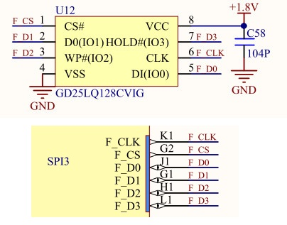

## 读写flash

本次实验代码详见src/flash。

flash 芯片 GD25LQ128C 是通过 SPI 串行闪存的芯片，具有 128M-bit(16 兆字节 MByte)空间，能够储存声音、文本和数据等，设备运行电源为 2.7V~3.6V，低功耗模式电流低至 1uA。

每次向 GD25LQ128C 写入数据都需要按照页或者扇区或者簇为单位进行，一页为 256 个字节，一个扇区为 4K 个字节（16 页），一次最多写一页，也就是一次最多写 256 个字节，如果超过一页数据长度，则分多次完成。可以从任何地址读出数据；擦除数据时，最小单位为一个扇区，也可以直接擦除整个 flash 芯片。

K210通过SPI总线来控制flash的读写，该flash的硬件原理图如下所示：



本次实验将通过一个flash读写案例来说明如何使用flash。w25qxx.c和w25qxx.h为flash的底层驱动代码，感兴趣的同学可以对照GD25LQ128C芯片原理图仔细研究，这里主要讲如何使用这款flash。

首先是固定的初始化代码：

```c
/* 设置新PLL0频率 */
sysctl_pll_set_freq(SYSCTL_PLL0, 800000000);
uarths_init();// 初始化串口打印
```

接下来初始化flash：

```c
/* 初始化flash */
uint8_t res = 0;
res = flash_init();
if (res == 0) return 0;
```

然后准备两块缓存：

```c
#define BUF_LENGTH (40 * 1024 + 5)
#define DATA_ADDRESS 0xB00000

uint8_t write_buf[BUF_LENGTH];
uint8_t read_buf[BUF_LENGTH];

/* 给缓存写入的数据赋值 */
for (int i = 0; i < BUF_LENGTH; i++)
    write_buf[i] = (uint8_t)(i);

/* 清空读取的缓存数据 */
for(int i = 0; i < BUF_LENGTH; i++)
    read_buf[i] = 0;
```

这里准备了两块缓冲区，write_buf缓冲区里设置了一些数据，这些数据将写入到flash中，read_buf则用于从flash中读取之前写入的数据：

```c
/* flash写入数据 */
flash_write_data(write_buf, BUF_LENGTH);

/*flash读取数据*/
flash_read_data(read_buf, BUF_LENGTH);

/* 比较数据，如果有不同则打印错误信息 */
for (int i = 0; i < BUF_LENGTH; i++)
{
    if (read_buf[i] != write_buf[i])
    {
        printf("flash read error\n");
        return 0;
    }
}
printf("spi3 flash master test ok\n");
```

整体代码逻辑非常简单，其中调用了三个函数：

```c
int flash_init(void);
void flash_write_data(uint8_t *data_buf, uint32_t length);
void flash_read_data(uint8_t *data_buf, uint32_t length);
```

这三个函数的内容非常固定，其细节内容可自行参照源代码。

通过如下命令将代码编译烧写到开发板中：

```c
cmake .. -DPROJ=flash -G "MinGW Makefiles"
make
kflash .\flash.bin -p COM6 -b 1500000
```

串口调试助手输出信息如下：

```c
flash init 
manuf_id:0xc8, device_id:0x17
flash start write data
write data finish:249949 us
read data finish:1657 us
spi3 flash master test ok
```


