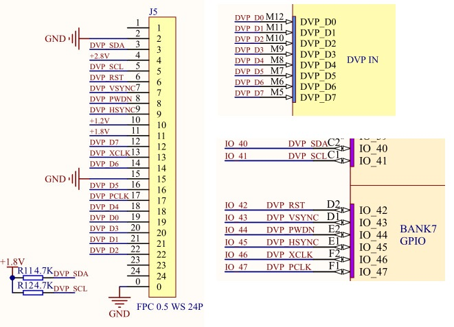

## 摄像头

本次实验代码可参考src/camera。

K210数字视频接口（Digital Video Port，DVP）是摄像头接口模块，支持DVP接口的摄像头，支持串行摄像机控制总线协议（Serial Camera Control Bus，SCCB）配置摄像头寄存器，最大支持640*480分辨率，通过简单的配置就可以让K210通过DVP接口读取摄像头采集的图像数据，方便将K210应用于各类图像相关产品中。

K210摄像头数字视频接口模块支持图像同时输出到KPU和显示屏，输出到KPU的格式可选RGB888和YUV422，输出到显示屏的格式为RGB565，每次检测到一帧开始或者一帧图像传输完成时可触发中断。

由于K210 DVP接口支持的分辨率为VGA（640*480 30W），所以实际使用选取30W像素的摄像头即可，开发板上的摄像头型号为OV2640。OV2640支持输出的图像最大像素为200W像素（1600x1200分辨率），其支持输出图像的数据格式有：JPEG、RGB565、YUV和YCbCr422等，支持使用VGA时序输出图像数据。OV2640输出的图像可从15~60帧调整，且可以根据不同的分辨率进行配置，其工作功率在125mW~140mW之间。

摄像头电路原理图如下所示：



本次实验需要配合LCD显示屏，将摄像头拍摄到的图像显示到LCD上。

硬件配置和初始化的代码相对比较固定，这里不再介绍。

接下来看看实验的主要业务逻辑：

```c
/* 初始化LCD */
lcd_init();

/* 初始化摄像头 */
ov2640_init();

while (1)
{
    /* 等待摄像头采集结束，然后清除结束标志 */
    while (g_dvp_finish_flag == 0)
        ;
    g_dvp_finish_flag = 0;

    /* 显示画面 */
    lcd_draw_picture(0, 0, 320, 240, display_buf_addr);
}
```

LCD初始化代码lcd_init在前面相关章节已经介绍过，但是有个细节需要注意。打开项目src/camera/lcd/lcd.c，定位到该函数：

```c
void lcd_init(void)
{
    uint8_t data = 0;
    /* 硬件初始化 */
    tft_hard_init();
    	...
    /* 打开显示反转 */
    tft_write_command(INVERSION_DISPLAY_ON);
    /* 设置LCD显示方向 */// DIR_YX_LRUD DIR_YX_RLUD DIR_YX_LRUD
    lcd_set_direction(DIR_YX_RLDU);
    	...
}
```

这里调用了lcd_set_direction来设置图片在LCD上显示的方式，是横向显示还是竖向显示，或者是镜像颠倒，这个和摄像头的摆放方式以及LCD有关，需要自己调整，有如下几个可以选择：

```c
/* LCD显示方向 */
typedef enum _lcd_dir
{
    DIR_XY_RLUD = 0x00,
    DIR_YX_RLUD = 0x20,
    DIR_XY_LRUD = 0x40,
    DIR_YX_LRUD = 0x60,
    DIR_XY_RLDU = 0x80,
    DIR_YX_RLDU = 0xA0,
    DIR_XY_LRDU = 0xC0,
    DIR_YX_LRDU = 0xE0,
    DIR_XY_MASK = 0x20,
    DIR_MASK = 0xE0,
} lcd_dir_t;
```

对于开发板，本次实验采用了DIR_YX_RLDU。

LCD初始化完毕后，调用ov2640_init函数初始化摄像头，该函数定义如下：

```c
/* 初始化ov2640摄像头 */
int ov2640_init(void)
{
    dvp_cam_init();
    dvp_cam_set_irq();

    uint16_t v_manuf_id;
    uint16_t v_device_id;
    ov2640_read_id(&v_manuf_id, &v_device_id);
    printf("manuf_id:0x%04x,device_id:0x%04x\n", v_manuf_id, v_device_id);
    uint16_t index = 0;
    for (index = 0; ov2640_config[index][0]; index++)
        dvp_sccb_send_data(OV2640_ADDR, ov2640_config[index][0], ov2640_config[index][1]);
    
    return 0;
}
```

这部分代码非常固定，没有什么好解释的，固定设置，然而需要留意这两个函数：

```c
dvp_cam_init();
dvp_cam_set_irq();
```

首先是dvp_cam_init函数：

```c
#define CAM_WIDTH_PIXEL        (320)
#define CAM_HIGHT_PIXEL        (240)

extern uint32_t display_buf_addr;
extern volatile uint8_t g_dvp_finish_flag;

/* dvp初始化 */
void dvp_cam_init(void)
{
    /* DVP初始化，设置sccb的寄存器长度为8bit */
    dvp_init(8);
    /* 设置输入时钟为24000000*/
    dvp_set_xclk_rate(24000000);
    /* 使能突发传输模式 */
    dvp_enable_burst();
    /* 关闭AI输出模式，使能显示模式 */
    dvp_set_output_enable(DVP_OUTPUT_AI, 0);
    dvp_set_output_enable(DVP_OUTPUT_DISPLAY, 1);
    /* 设置输出格式为RGB */
    dvp_set_image_format(DVP_CFG_RGB_FORMAT);
    /* 设置输出像素大小为320*240 */
    dvp_set_image_size(CAM_WIDTH_PIXEL, CAM_HIGHT_PIXEL);

    /* 设置DVP的显示地址参数和中断 */
    display_buf = (uint32_t*)iomem_malloc(CAM_WIDTH_PIXEL * CAM_HIGHT_PIXEL * 2);
    display_buf_addr = display_buf;
    dvp_set_display_addr((uint32_t)display_buf_addr);
    dvp_config_interrupt(DVP_CFG_START_INT_ENABLE | DVP_CFG_FINISH_INT_ENABLE, 0);
    dvp_disable_auto();
}
```

在该函数中主要设置了摄像头拍摄图像的格式、分辨率和输出图像地址，代码比较固定。需要注意的是这里还关闭了AI输出模式，该模式在后面的目标检测等需要用到KPU的场合会开启，这里将其关闭。

接下来是dvp_cam_set_irq函数：

```c
void dvp_cam_set_irq(void)
{
    /* DVP 中断配置：中断优先级，中断回调，使能DVP中断 */
    printf("DVP interrupt config\r\n");
    plic_set_priority(IRQN_DVP_INTERRUPT, 1);
    plic_irq_register(IRQN_DVP_INTERRUPT, on_dvp_irq_cb, NULL);
    plic_irq_enable(IRQN_DVP_INTERRUPT);

    /* 清除DVP中断位 */
    g_dvp_finish_flag = 0;
    dvp_clear_interrupt(DVP_STS_FRAME_START | DVP_STS_FRAME_FINISH);
    dvp_config_interrupt(DVP_CFG_START_INT_ENABLE | DVP_CFG_FINISH_INT_ENABLE, 1);
}
```

这里采用了DVP中断方式，可以这样理解，摄像头每拍摄好一帧图片便会触发一次中断，在中断回调函数中：

```c
uint32_t *display_buf = NULL;
uint32_t display_buf_addr = 0;
volatile uint8_t g_dvp_finish_flag;

/* dvp中断回调函数 */
static int on_dvp_irq_cb(void *ctx)
{
    /* 读取DVP中断状态，如果完成则刷新显示地址的数据，并清除中断标志，否则读取摄像头数据*/
    if (dvp_get_interrupt(DVP_STS_FRAME_FINISH))
    {
        dvp_set_display_addr((uint32_t)display_buf_addr);
        dvp_clear_interrupt(DVP_STS_FRAME_FINISH);
        g_dvp_finish_flag = 1;
    }
    else
    {
        if (g_dvp_finish_flag == 0)
            dvp_start_convert();
        dvp_clear_interrupt(DVP_STS_FRAME_START);
    }
    return 0;
}
```

当中断发生后，便设置好拍摄图片的输出地址，这里的输出地址也就是LCD的显示地址：

```c
dvp_set_display_addr((uint32_t)display_buf_addr);
```

在main函数中，LCD会等待中断发生，中断发生后，摄像头拍摄图片会写入到display_buf_addr中，LCD便可以将该地址图片显示出来：

```c
while (1)
{
    /* 等待摄像头采集结束，然后清除结束标志 */
    while (g_dvp_finish_flag == 0)
        ;
    g_dvp_finish_flag = 0;

    /* 显示画面 */
    lcd_draw_picture(0, 0, 320, 240, display_buf_addr);
}
```

通过如下命令编译烧写代码到开发板中：

```c
cmake .. -DPROJ=camera -G "MinGW Makefiles"
make
kflash .\camera.bin -p COM6 -b 1500000
```

可以看到摄像头拍摄画面在LCD中显示，如果你的LCD上显示的画面有颠倒和镜像情况，可以结合前面的分析自行调整。