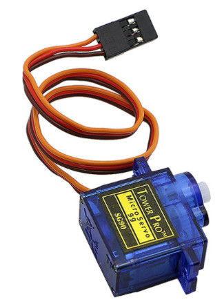

## 伺服舵机

本次实验采用的是普通的9g舵机：


舵机的信号口和开发板的IO10口相连，通过PWM开控制舵机的转动，代码非常简单：

```c
#include <stdio.h>
#include <unistd.h>
#include <syslog.h>
#include <timer.h>
#include <pwm.h>
#include <plic.h>
#include <sysctl.h>
#include <fpioa.h>

#define SERVO_FREQ (50)
#define SERVO0_DUTY_MAX (0.09)
#define SERVO0_DUTY_MIN (0.02)

/**
* Function       servo_move_angle
* @author        jackster
* @date          2020.12.05
* @brief         PWM控制舵机
* @par History   无
*/
/* 
* -90度对应的duty为0.02
* 90度对应的duty为0.09
* 假设占空比线性关系为： duty = a * angle + b
* 求解：
* 0.02 = -90 * a + b
* 0.09 = 90 *a + b
* 得出：
* a = (0.09 - 0.02) / 180
* b = (0.02 + 90 * (0.09 - 0.02) / 180 )
* duty = angle * (0.09 - 0.02) / 180 + (0.09 + 0.02) / 2
*/
double servo_move_angle(pwm_device_number_t pwm_number, pwm_channel_number_t channel, double frequency, int angle)
{
    double duty = angle * (SERVO0_DUTY_MAX - SERVO0_DUTY_MIN) / 180 + (SERVO0_DUTY_MAX + SERVO0_DUTY_MIN) / 2;
    return pwm_set_frequency(pwm_number, channel, frequency, duty);
}

int main(void)
{
    /* 硬件引脚初始化 */
    fpioa_set_function(10, FUNC_TIMER2_TOGGLE1);

    /* 系统中断初始化和使能 */
    plic_init();
    sysctl_enable_irq();

    pwm_init(PWM_DEVICE_2);
    /* Set PWM to 50Hz */
    servo_move_angle(PWM_DEVICE_2, TIMER_CHANNEL_0, SERVO_FREQ, 0);
    pwm_set_enable(PWM_DEVICE_2, TIMER_CHANNEL_0, 1);

    while (1)
    {
        servo_move_angle(PWM_DEVICE_2, TIMER_CHANNEL_0, SERVO_FREQ, -90);
        sleep(1);
        servo_move_angle(PWM_DEVICE_2, TIMER_CHANNEL_0, SERVO_FREQ, -45);
        sleep(1);
        servo_move_angle(PWM_DEVICE_2, TIMER_CHANNEL_0, SERVO_FREQ, 0);
        sleep(1);
        servo_move_angle(PWM_DEVICE_2, TIMER_CHANNEL_0, SERVO_FREQ, 45);
        sleep(1);
        servo_move_angle(PWM_DEVICE_2, TIMER_CHANNEL_0, SERVO_FREQ, 90);
        sleep(1);
    }
}
```

可自行编译烧写到开发板中。