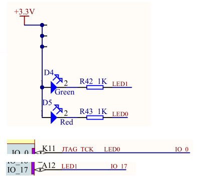
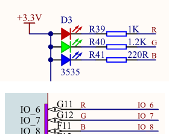
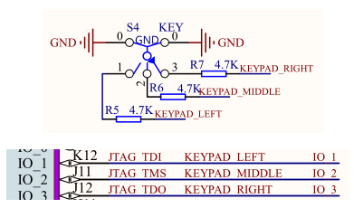

## 输入输出

### 一、FPIOA介绍

K210现场可编程IO阵列（Field Programmable Input Output Array，FPIOA）允许用户将255个内部功能（SPI、UART等硬件资源）映射到K210芯片外围的48个自由IO口上，每个IO口都有一个32位宽的寄存器，可独立地实现施密特触发器、反向输入、反向输出、强上拉、驱动选择器等功能，此外，它还可以实现任何外设的任何接口连接。

K210的FPIOA与STM32/Arduino等单片机的使用和配置方式有所不同，传统意义上的GPIO寄存器会绑定一些特定且固定的功能，如某个管脚只能有输入输出功能，某些特定的硬件功能（如SPI、IIC）在芯片设计时就和某些特定编号的管脚绑定，如果用户要使用这些特定的总线资源，在线路设计时必须找到这些特定功能的管脚，再结合外设设计电路，简言之，IO口和硬件功能绑定，用户不可修改。而K210的FPIOA不然，K210的GPIO接口编程非常灵活，用户可以将K210的48个物理IO口通过软件配置并绑定硬件功能。

关于更详细的一些SDK使用说明，可参考勘智官方提供的kendryte_standalone_programming_guide文档，该文档下载地址在 https://canaan-creative.com/developer 。

接下来将通过一些案例来说明这种配置方法。

### 二、点亮LED灯

**该部分的实验代码可见src/gpio_led目录。**

首先看开发板，开发板上有两个LED灯，其电路原理图如下：



首先定义一个头文件pin_config.h，头文件内容如下：

```c
#ifndef _PIN_CONFIG_H_
#define _PIN_CONFIG_H_
/*****************************HEAR-FILE************************************/
#include "fpioa.h"

/*****************************HARDWARE-PIN*********************************/
// 硬件IO口，与原理图对应
#define PIN_LED_0             (0)
#define PIN_LED_1             (17)

/*****************************SOFTWARE-GPIO********************************/
// 软件GPIO口，与程序对应
#define LED0_GPIONUM          (0)
#define LED1_GPIONUM          (1)

/*****************************FUNC-GPIO************************************/
// GPIO口的功能，绑定到硬件IO口
#define FUNC_LED0             (FUNC_GPIO0 + LED0_GPIONUM)
#define FUNC_LED1             (FUNC_GPIO0 + LED1_GPIONUM)

#endif /* _PIN_CONFIG_H_ */
```

定义的PIN_LED_0和PIN_LED_1为两LED和K210的物理连接口。需要注意的是FUNC_LED0和FUNC_LED1，这两个是GPIO的功能定义，在fpioa.h中有：

```c
    FUNC_GPIO0            = 56, /*!< GPIO pin 0 */
    FUNC_GPIO1            = 57, /*!< GPIO pin 1 */
    FUNC_GPIO2            = 58, /*!< GPIO pin 2 */
    FUNC_GPIO3            = 59, /*!< GPIO pin 3 */
    FUNC_GPIO4            = 60, /*!< GPIO pin 4 */
    FUNC_GPIO5            = 61, /*!< GPIO pin 5 */
    FUNC_GPIO6            = 62, /*!< GPIO pin 6 */
    FUNC_GPIO7            = 63, /*!< GPIO pin 7 */
```

K210中提供了八个普通的IO口，接下来就需要将物理端口和功能端口联系到起来。

首先是下面这个函数：

```c
void hardware_init(void)
{
    fpioa_set_function(PIN_LED_0, FUNC_LED0);
    fpioa_set_function(PIN_LED_1, FUNC_LED1);
}
```

该函数中调用了fpioa_set_function函数将物理端口和功能端口绑定，通过上述绑定后，K210的物理0号端口扮演者FUNC_GPIO0的角色，物理17号端口扮演FUNC_GPIO1的角色。这种映射的好处是用户可以根据自己的情况和喜好来定义某个物理GPIO管脚的功能，该物理GPIO可能非常灵活。

接下来调用SDK中的：

```c
gpio_init();
```

来初始化GPIO。

接着设置这些管脚的输入输出模式，从电路原理图可见，如果点亮LED需要设置管脚电平为0，熄灭LED需要设置管脚电平为1：

```c
// 设置LED0和LED1的GPIO模式为输出
gpio_set_drive_mode(LED0_GPIONUM, GPIO_DM_OUTPUT);
gpio_set_drive_mode(LED1_GPIONUM, GPIO_DM_OUTPUT);
```

从前面的配置可见：

```
#define LED0_GPIONUM          (0)
#define LED1_GPIONUM          (1)

// GPIO口的功能，绑定到硬件IO口
#define FUNC_LED0             (FUNC_GPIO0 + LED0_GPIONUM)
#define FUNC_LED1             (FUNC_GPIO0 + LED1_GPIONUM)
```

目前使用的功能端口是FUNC_GPIO0和FUNC_GPIO1（FUNC_GPIO0 + LED1_GPIONUM），前面的fpioa_set_function函数将物理端口号绑定到了FUNC_GPIO0和FUNC_GPIO1上，所以gpio_set_drive_mode可以直接通过功能端口**序号**来设置其输入输出模式。具体为什么这样做，可以参考最后的**附录**，附录中会对源码进行简单分析。

其中GPIO_DM_OUTPUT为一个枚举值：

```c
typedef enum _gpio_drive_mode
{
    GPIO_DM_INPUT,
    GPIO_DM_INPUT_PULL_DOWN,
    GPIO_DM_INPUT_PULL_UP,
    GPIO_DM_OUTPUT,
} gpio_drive_mode_t;
```

有了前面的设置后，接下来就可以两GPIO的输出值，从而控制LED的闪烁了：

```c
// 先关闭LED0和LED1
gpio_pin_value_t value = GPIO_PV_HIGH;
gpio_set_pin(LED0_GPIONUM, value);
gpio_set_pin(LED1_GPIONUM, value);

while (1)
{
    sleep(1);
    gpio_set_pin(LED0_GPIONUM, value);
    gpio_set_pin(LED1_GPIONUM, value = !value);
}
```

接下来分别在build目录下输入下面三个命令，编译烧写程序到开发板上：

```
cmake .. -DPROJ=gpio_led -G "MinGW Makefiles"
make
kflash gpio_led.bin -p COM6 -b 1500000
```

实验现象是开发板上的红绿两LED等交替闪烁。

### 三、点亮RGB三色灯

有了前面的基础，这部分的实验就相对容易了，实验的代码在src/gpiohs_rgb中。

前面一节的实验使用了普通的GPIO口，本章将介绍K210的另一种IO口--高速的GPIOHS。

开发板上的RGB三色灯与K210的接口原理图如下：



首先是管脚配置文件pin_config.h：

```c
#include "fpioa.h"

/*****************************HARDWARE-PIN*********************************/
// 硬件IO口，与原理图对应
#define PIN_RGB_R             (6)
#define PIN_RGB_G             (7)
#define PIN_RGB_B             (8)

/*****************************SOFTWARE-GPIO********************************/
// 软件GPIO口，与程序对应
#define RGB_R_GPIONUM          (0)
#define RGB_G_GPIONUM          (1)
#define RGB_B_GPIONUM          (2)

/*****************************FUNC-GPIO************************************/
// GPIO口的功能，绑定到硬件IO口
#define FUNC_RGB_R             (FUNC_GPIOHS0 + RGB_R_GPIONUM)
#define FUNC_RGB_G             (FUNC_GPIOHS0 + RGB_G_GPIONUM)
#define FUNC_RGB_B             (FUNC_GPIOHS0 + RGB_B_GPIONUM)

#endif /* _PIN_CONFIG_H_ */
```

从配置中可以看到，K210的6、7、8号物理管脚绑定了FUNC_GPIOHS0、FUNC_GPIOHS1和FUNC_GPIOHS2。K210中有32个高速GPIOHS管脚：

```c
FUNC_GPIOHS0          = 24, /*!< GPIO High speed 0 */
FUNC_GPIOHS1          = 25, /*!< GPIO High speed 1 */
FUNC_GPIOHS2          = 26, /*!< GPIO High speed 2 */
	...
FUNC_GPIOHS30         = 54, /*!< GPIO High speed 30 */
FUNC_GPIOHS31         = 55, /*!< GPIO High speed 31 */
```

其余的部分和上一节的配置类似，这里直接贴代码：

```c
#include "sleep.h"
#include "gpiohs.h"
#include "pin_config.h"

void hardware_init(void)
{
    // fpioa映射
    fpioa_set_function(PIN_RGB_R, FUNC_RGB_R);
    fpioa_set_function(PIN_RGB_G, FUNC_RGB_G);
    fpioa_set_function(PIN_RGB_B, FUNC_RGB_B);

}

void rgb_all_off(void)
{
    gpiohs_set_pin(RGB_R_GPIONUM, GPIO_PV_HIGH);
    gpiohs_set_pin(RGB_G_GPIONUM, GPIO_PV_HIGH);
    gpiohs_set_pin(RGB_B_GPIONUM, GPIO_PV_HIGH);
}

void init_rgb(void)
{
    // 设置RGB灯的GPIO模式为输出
    gpiohs_set_drive_mode(RGB_R_GPIONUM, GPIO_DM_OUTPUT);
    gpiohs_set_drive_mode(RGB_G_GPIONUM, GPIO_DM_OUTPUT);
    gpiohs_set_drive_mode(RGB_B_GPIONUM, GPIO_DM_OUTPUT);

    // 关闭RGB灯
    rgb_all_off();
}

int main(void)
{
    // RGB灯状态，0=红灯亮，1=绿灯亮，2=蓝灯亮
    int state = 0;

    // 硬件引脚初始化
    hardware_init();
    // 初始化RGB灯
    init_rgb();

    while (1)
    {
        rgb_all_off();   // 先关闭RGB灯
        // 根据state的值点亮不同颜色的灯
        gpiohs_set_pin(state, GPIO_PV_LOW);
        msleep(500);
        state++;
        state = state % 3;
    }
    return 0;
}
```

需要注意的是，使用gpiohs功能时调用的函数是gpiohs_set_pin和gpiohs_set_drive_mode，这里要和前面的GPIO区分。

除去配置相关内容，代码中的业务逻辑就是轮流点亮RGB三种颜色的灯。

最后通过以下命令编译烧写：

```c
cmake .. -DPROJ=gpiohs_rgb -G "MinGW Makefiles"
make
kflash .\gpiohs_rgb.bin -p COM6 -b 1500000
```

### 四、使用keypad控制LED灯

该部分实验代码可见src/keypad。

拨轮开关 keypad 具有三个通道，分别是 L：表示向左滚动、M：表示按下，R：表示向右滚动。每一次只能操作一个通道，并且 keypad 在释放状态下，三个通道都是高电平，如果其中一个通道被按下时，对应的 IO 口电平会变成低电平。可以理解为 keypad 是三个按键组合在一起，但是每次只能使用其中一个按键。

开发板上的keypad电路原理图为：



现在的需求是通过拨动拨轮开关的三个通道，分别点亮RGB三色灯中的不同颜色。实验的原理就是不断轮询哪个按键被拨动，然后选择对应的LED点亮。

实验所用到IO口配置如下：

```c
#ifndef _PIN_CONFIG_H_
#define _PIN_CONFIG_H_
/*****************************HEAR-FILE************************************/
#include "fpioa.h"

/*****************************HARDWARE-PIN*********************************/
// 硬件IO口，与原理图对应
#define PIN_RGB_R              (6)
#define PIN_RGB_G              (7)
#define PIN_RGB_B              (8)

#define PIN_KEYPAD_LEFT        (1)
#define PIN_KEYPAD_MIDDLE      (2)
#define PIN_KEYPAD_RIGHT       (3)

/*****************************SOFTWARE-GPIO********************************/
// 软件GPIO口，与程序对应
#define RGB_R_GPIONUM          (0)
#define RGB_G_GPIONUM          (1)
#define RGB_B_GPIONUM          (2)

#define KEYPAD_LEFT_GPIONUM    (3)
#define KEYPAD_MIDDLE_GPIONUM  (4)
#define KEYPAD_RIGHT_GPIONUM   (5)

/*****************************FUNC-GPIO************************************/
// GPIO口的功能，绑定到硬件IO口
#define FUNC_RGB_R             (FUNC_GPIOHS0 + RGB_R_GPIONUM)
#define FUNC_RGB_G             (FUNC_GPIOHS0 + RGB_G_GPIONUM)
#define FUNC_RGB_B             (FUNC_GPIOHS0 + RGB_B_GPIONUM)

#define FUNC_KEYPAD_LEFT       (FUNC_GPIOHS0 + KEYPAD_LEFT_GPIONUM)
#define FUNC_KEYPAD_MIDDLE     (FUNC_GPIOHS0 + KEYPAD_MIDDLE_GPIONUM)
#define FUNC_KEYPAD_RIGHT      (FUNC_GPIOHS0 + KEYPAD_RIGHT_GPIONUM)

#endif /* _PIN_CONFIG_H_ */
```

IO口的初始化代码代码如下：

```c
void hardware_init(void)
{
    /* fpioa映射 */
    fpioa_set_function(PIN_RGB_R, FUNC_RGB_R);
    fpioa_set_function(PIN_RGB_G, FUNC_RGB_G);
    fpioa_set_function(PIN_RGB_B, FUNC_RGB_B);

    fpioa_set_function(PIN_KEYPAD_LEFT,   FUNC_KEYPAD_LEFT);
    fpioa_set_function(PIN_KEYPAD_MIDDLE, FUNC_KEYPAD_MIDDLE);
    fpioa_set_function(PIN_KEYPAD_RIGHT,  FUNC_KEYPAD_RIGHT);

}

void rgb_all_off(void)
{
    gpiohs_set_pin(RGB_R_GPIONUM, GPIO_PV_HIGH);
    gpiohs_set_pin(RGB_G_GPIONUM, GPIO_PV_HIGH);
    gpiohs_set_pin(RGB_B_GPIONUM, GPIO_PV_HIGH);
}

void init_rgb(void)
{
    /* 设置RGB灯的GPIO模式为输出 */
    gpiohs_set_drive_mode(RGB_R_GPIONUM, GPIO_DM_OUTPUT);
    gpiohs_set_drive_mode(RGB_G_GPIONUM, GPIO_DM_OUTPUT);
    gpiohs_set_drive_mode(RGB_B_GPIONUM, GPIO_DM_OUTPUT);

    /* 关闭RGB灯 */
    rgb_all_off();
}

void init_keypad(void)
{
    /* 设置keypad的GPIO模式为上拉输入 */
    gpiohs_set_drive_mode(KEYPAD_LEFT_GPIONUM,   GPIO_DM_INPUT_PULL_UP);
    gpiohs_set_drive_mode(KEYPAD_MIDDLE_GPIONUM, GPIO_DM_INPUT_PULL_UP);
    gpiohs_set_drive_mode(KEYPAD_RIGHT_GPIONUM,  GPIO_DM_INPUT_PULL_UP);
}
```

需要注意的是，按键的IO口设置了上拉输入模式。

检测按键按下的业务代码如下：

```c
void scan_keypad(void)
{
    /* 读取keypad三个通道的状态 */
    gpio_pin_value_t state_keypad_left =   gpiohs_get_pin(KEYPAD_LEFT_GPIONUM);
    gpio_pin_value_t state_keypad_middle = gpiohs_get_pin(KEYPAD_MIDDLE_GPIONUM);
    gpio_pin_value_t state_keypad_right =  gpiohs_get_pin(KEYPAD_RIGHT_GPIONUM);

    /* 检测keypad是否向左滚动 */
    if (!state_keypad_left)
    {
        /* 延迟消抖10ms */
        msleep(10);
        /* 再次读keypad向左的IO口的状态 */
        state_keypad_left = gpiohs_get_pin(KEYPAD_LEFT_GPIONUM);
        if (!state_keypad_left)
        {
            /* 向左滚动，点亮红灯 */
            gpiohs_set_pin(RGB_R_GPIONUM, GPIO_PV_LOW);
        }
        else
        {
            /* 松开，红灯熄灭 */
            gpiohs_set_pin(RGB_R_GPIONUM, GPIO_PV_HIGH);
        }
    } 
    /* 检测keypad是否被按下 */
    else if (!state_keypad_middle)
    {
        msleep(10);
        state_keypad_middle = gpiohs_get_pin(KEYPAD_MIDDLE_GPIONUM);
        if (!state_keypad_middle)
        {
            gpiohs_set_pin(RGB_G_GPIONUM, GPIO_PV_LOW);
        }
        else
        {
            gpiohs_set_pin(RGB_G_GPIONUM, GPIO_PV_HIGH);
        }
    } 
    /* 检测keypad是否向右滚动 */
    else if (!state_keypad_right)
    {
        msleep(10);
        state_keypad_right = gpiohs_get_pin(KEYPAD_RIGHT_GPIONUM);
        if (!state_keypad_right)
        {
            gpiohs_set_pin(RGB_B_GPIONUM, GPIO_PV_LOW);
        }
        else
        {
            gpiohs_set_pin(RGB_B_GPIONUM, GPIO_PV_HIGH);
        }
    }
}
```

检测代码首先会调用gpiohs_get_pin函数分别读取三个按键输入通道的值，接通的一路通道输入值为0。为了防止按键按下时手的抖动，这里采用了延时消抖的手段，连续两次检测按键按下的状态，两次检测之间休眠10ms，如果两次检测到按键按下，那么接通对应的LED灯，如果按键松开，那么关闭对应的LED灯。

主程序如下所示：

```c
int main(void)
{
    /* 硬件引脚初始化 */
    hardware_init();
    
    /* 初始化RGB灯 */
    init_rgb();

    /* 初始化keypad */
    init_keypad();

    while (1)
    {
        /* 扫描keypad并控制RGB灯 */
        scan_keypad();
    }

    return 0;
}
```

初始化硬件之后，在一个while循环中不断轮询检测按键的状态。

最后在build目录下通过如下命令编译烧写程序到开发板中。

```c
cmake .. -DPROJ=keypad -G "MinGW Makefiles"
make
kflash .\keypad.bin -p COM6 -b 1500000
```

### 附录

在前面的配置中分别用到了gpiohs_set_drive_mode和gpio_set_drive_mode，这里先以gpio_set_drive_mode为例：

```c
// 软件GPIO口，与程序对应
#define LED0_GPIONUM          (0)
#define LED1_GPIONUM          (1)

/*****************************FUNC-GPIO************************************/
// GPIO口的功能，绑定到硬件IO口
#define FUNC_LED0             (FUNC_GPIO0 + LED0_GPIONUM)
#define FUNC_LED1             (FUNC_GPIO0 + LED1_GPIONUM)
```

调用该函数时：

```c
// 设置LED0和LED1的GPIO模式为输出
gpio_set_drive_mode(LED0_GPIONUM, GPIO_DM_OUTPUT);
gpio_set_drive_mode(LED1_GPIONUM, GPIO_DM_OUTPUT);
```

gpio_set_drive_mode函数的第一个参数传入的是LED0_GPIONUM的值，而非我们理解的FUNC_LED0值，毕竟FUNC_LED0的值是FUNC_GPIO0，是实实在在的功能端口号。

于是我们可以查看gpio_set_drive_mode的源码，看看这个LED0_GPIONUM是如何与FUNC_GPIO0联系起来的：

```c
void gpio_set_drive_mode(uint8_t pin, gpio_drive_mode_t mode)
{
    configASSERT(pin < GPIO_MAX_PINNO);
    int io_number = fpioa_get_io_by_function(FUNC_GPIO0 + pin);
    configASSERT(io_number >= 0);
    ....
```

这里截取了该函数的部分，从该部分中可以看到：

```c
int io_number = fpioa_get_io_by_function(FUNC_GPIO0 + pin);
```

传入的pin值会和FUNC_GPIO0相加，得到目标逻辑端口号。这里就解释了为什么gpio_set_drive_mode函数传入的不是FUNC_LED0/FUNC_GPIO0的值，gpio_set_drive_mode函数的第一个参数表示从FUNC_GPIO0开始的序号值，即以FUNC_GPIO0为基准的序号。

同样地，在gpiohs_set_drive_mode函数中也可以看到类似的设置：

```c
void gpiohs_set_drive_mode(uint8_t pin, gpio_drive_mode_t mode)
{
    configASSERT(pin < GPIOHS_MAX_PINNO);
    int io_number = fpioa_get_io_by_function(FUNC_GPIOHS0 + pin);
    configASSERT(io_number >= 0);

```

**结论**：gpio_set_drive_mode和gpiohs_set_drive_mode的第一个参数是FUNC_GPIO0/FUNC_GPIOHS0的偏移值，这两个函数可以通过该偏移值取得实际的功能端口值。