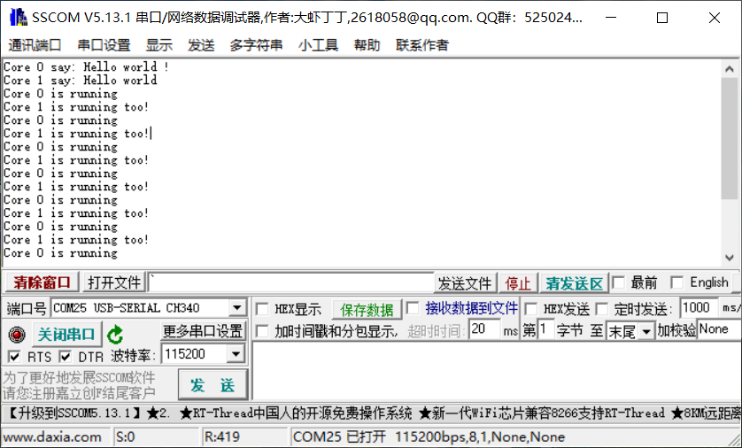

## 双核并行

K210 芯片搭载基于 RISC-V ISA 的双核心 64 位的高性能低功耗 CPU，接下来通过一个简答的案例来说明如何使用K210的双核。

实验代码可见src/dual_core。

直接看下面这段代码：

```c
#include <stdio.h>
#include "bsp.h"
#include "sleep.h"
#include "sysctl.h"

int core1_main(void *ctx)
{
    uint64_t core = current_coreid();
    printf("Core %ld say: Hello world\n", core);

    while(1)
    {
        sleep(1);
        printf("Core %ld is running too!\n", core);
    }
}

int main(void)
{
    /* 读取当前运行的核心编号 */
    uint64_t core = current_coreid();
    printf("Core %ld say: Hello world !\n", core);
    /* 注册核心1，并启动核心1 */
    register_core1(core1_main, NULL);

    while(1)
    {
        sleep(1);
        printf("Core %ld is running\n", core);
    }
    return 0;
}
```

K210 SDK提供了current_coreid函数来获取当前运行的CPU核编号，默认是在0号核心上运行。接下来调用了register_core1函数来注册并启动另一个核。该函数原型如下：

```c
int register_core1(core_function func, void *ctx)
```

* 参数1为在CPU核心1上运行的代码逻辑，其定义如下：

  ```c
  typedef int (*core_function)(void *ctx);
  ```

* 参数2为传入到func的参数

注册完核心1函数之后，main函数每隔1s打印一次当前核心编号信息。同样地，在cpu核心1上运行函数也每隔1s打印一次核心信息。

通过如下命令编译烧写程序到开发板中：

```c
cmake .. -DPROJ=dual_core -G "MinGW Makefiles"
make
kflash .\dual_core.bin -p COM25 -b 1500000
```

重启开发板，通过串口调试助手可以看到：



K210的两个CPU核交替打印信息。