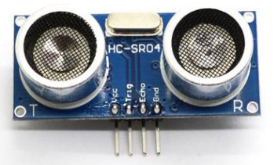

## 超声波模块

这里使用的是普通的超声波模块：



首先设置超声波模块与开发板的连接：

```c
/*****************************HARDWARE-PIN*********************************/
// 硬件IO口，与原理图对应
#define PIN_TRIG             (12)
#define PIN_ECHO             (13)

/*****************************SOFTWARE-GPIO********************************/
// 软件GPIO口，与程序对应
#define TRIG_GPIONUM          (0)
#define ECHO_GPIONUM          (1)

/*****************************FUNC-GPIO************************************/
// GPIO口的功能，绑定到硬件IO口
#define FUNC_TRIG             (FUNC_GPIOHS0 + TRIG_GPIONUM)
#define FUNC_ECHO             (FUNC_GPIOHS0 + ECHO_GPIONUM)

#endif /* _PIN_CONFIG_H_ */
```

接下来是主程序逻辑：

```c
void hardware_init(void)
{
    // fpioa映射
    fpioa_set_function(PIN_TRIG, FUNC_TRIG);
    fpioa_set_function(PIN_ECHO, FUNC_ECHO);
}

int main(void)
{
    // 硬件引脚初始化
    hardware_init();
    
    while (1)
    {
        long distance = ultrasonic_measure_cm(FUNC_TRIG, FUNC_ECHO, 3000000);
        printf("%ld cm\n", distance);
        sleep(1);
    }
    return 0;
}
```

调用ultrasonic_measure_cm测距，该函数在ultrasonic.c和ultrasonic.h中定义，这两个文件是超声波模块的驱动文件，主要提供了如下两个测距函数：

```c
long ultrasonic_measure_cm(uint8_t trig_fun, uint8_t echo_fun, uint32_t timeout_us);
long ultrasonic_measure_inch(uint8_t trig_fun, uint8_t echo_fun, uint32_t timeout_us);
```

编译烧写到开发板中，使用串口调试工具查看打印的距离信息。

需要注意的是，超声波模块有时测距值一直是0，这可能和连接电源的管脚有关，超声波模块供电电压为5v，有些模块可能不支持3.3v供电。