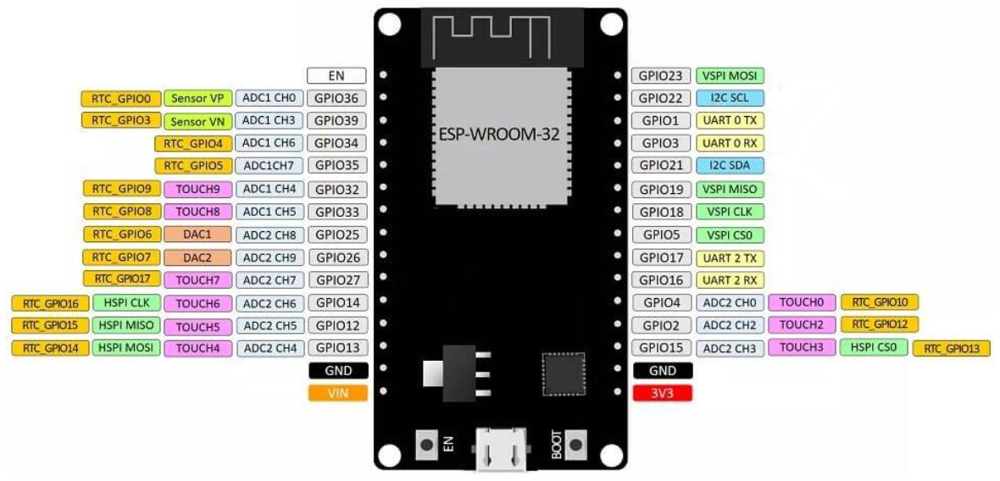
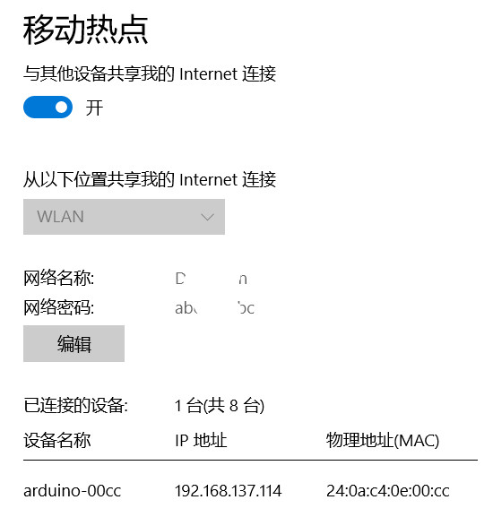
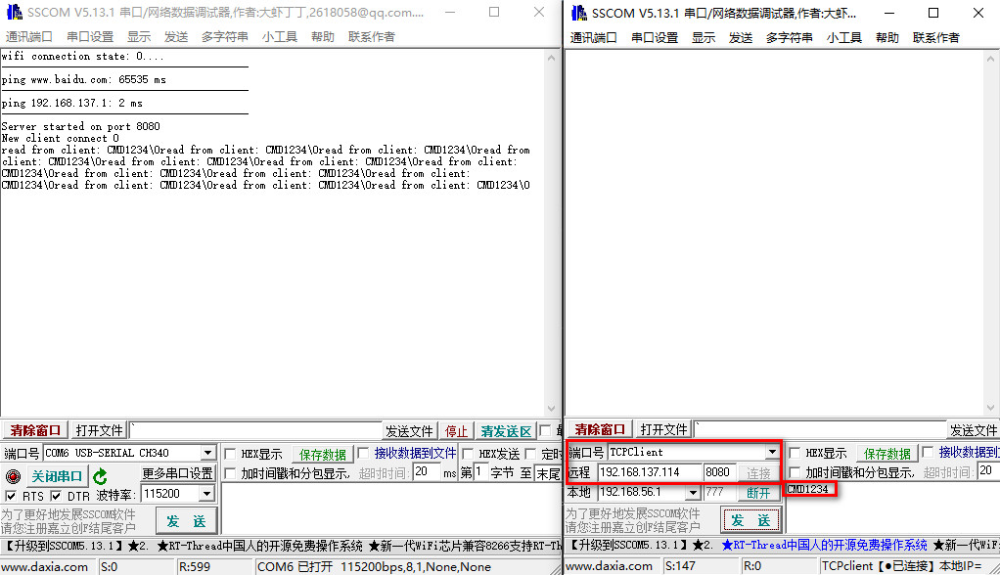
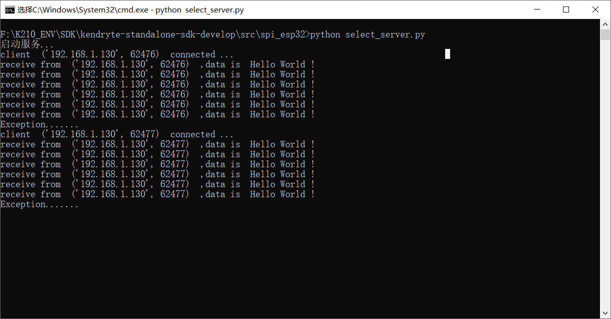
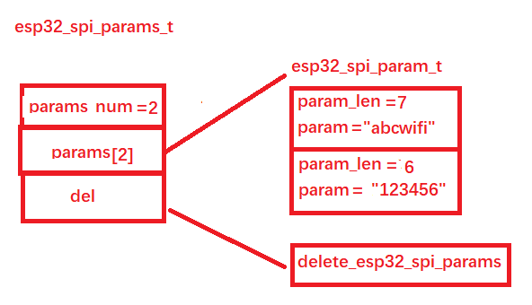
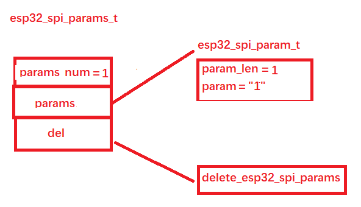

## TCP编程

**学习这一章时，建议有TCP/IP协议学习和编程经验。**

### 一、ESP32

在介绍这部分内容前，非常有必要了解ESP32这款WIFI模组。ESP32是一款流行的支持WiFi和蓝牙的双核芯片。其内部参数如下：

- 内核: Xtensa Dual-Core 32-bit LX6
- CPU 频率: up to 240MHz
- 可用 RAM : 528KB (一部分预留给系统使用)
- BootROM: 448KB
- 内置 FlashROM: none
- 外置 FlashROM: 代码数据, SPI Flash; 通常为 4MB
- GPIO: 34 (GPIOs与其他函数进行多路复用，包括外接flash、UART等)
- UART: 3 RX/TX UART (没有硬件握手，单纯rx tx), 1个只发TX UART
- SPI: 4 SPI 接口 (1个被SPI FlashROM使用了)
- I2C: 2 I2C （任何引脚上都能使用）
- I2S: 2
- ADC: 12-bit SAR ADC 可以用在18个引脚上
- DAC: 2 8-bit DACs
- 编程: 通过UART使用引导下载到使用 BootROM 也可以是外部flash中 ，不论如何都是引导到 BootROM bootloader永远可用,不至于ESP32变砖

本次实验采用的开发板接口图如下：



接下来需要往ESP32中烧写固件代码，固件烧写的过程可以参考这个链接：https://cn.maixpy.sipeed.com/zh/get_started/upgrade_esp32_firmware.html

直接将ESP32开发通过USB线插入电脑，然后根据上面链接内容下载固件、下载flash工具，按照步骤将固件烧写进开发板即可。固件的的源码可以在这个链接中找到：https://github.com/sipeed/Maixduino_esp32_fimware

如果你之前用过Arduino而且你的Arduino环境中配置并支持ESP32，你也可以使用我修改过的代码，在Arduino中打开，然后将代码编译烧写到ESP32中。支持Arduino IDE编译的代码在src/ESP32_Arduino_SPIS_Demo目录中。

ESP32中更新固件内容之后便可以将ESP32和K210连接了，连接如下：

```c
/***************************************
 *      K210_GPIO    |       ESP32     *
 * =================================== *
 *          IO25     |        IO5      *
 *          IO27     |        IO18     *
 *          IO26     |        IO23     *
 *          IO28     |        IO14     *
 *          IO8      |        RST      * 
 *          IO9      |        IO25     * 
 *          5V       |        5V       * 
 *          GND      |        GND      * 
 ***************************************/
```

到这一步，前期的准备工作便完成了，ESP32充当了K210的无线网卡。

本文实验，K210中所有和网络相关的代码都在src/xxx/net目录下，无线网卡驱动提供了如下API调用：

```c
void esp32_spi_init(void);
int8_t esp32_spi_status(void);
char *esp32_spi_firmware_version(char* fw_version);
uint8_t *esp32_spi_MAC_address(void);

int8_t esp32_spi_start_scan_networks(void);
esp32_spi_aps_list_t *esp32_spi_get_scan_networks(void);
esp32_spi_aps_list_t *esp32_spi_scan_networks(void);
int8_t esp32_spi_wifi_set_network(uint8_t *ssid);
int8_t esp32_spi_wifi_wifi_set_passphrase(uint8_t *ssid, uint8_t *passphrase);
char *esp32_spi_get_ssid(void);
int8_t esp32_spi_get_rssi(void);
esp32_spi_net_t *esp32_spi_get_network_data(void);
int8_t esp32_spi_ip_address(uint8_t *net_data);
uint8_t esp32_spi_is_connected(void);
void esp32_spi_connect(uint8_t *secrets);
int8_t esp32_spi_connect_AP(uint8_t *ssid, uint8_t *password, uint8_t retry_times);
int8_t esp32_spi_disconnect_from_AP(void);
void esp32_spi_pretty_ip(uint8_t *ip, uint8_t *str_ip);
int esp32_spi_get_host_by_name(uint8_t *hostname, uint8_t *ip);
int32_t esp32_spi_ping(uint8_t *dest, uint8_t dest_type, uint8_t ttl);

uint8_t esp32_spi_get_socket(void);
int8_t esp32_spi_socket_open(uint8_t sock_num, uint8_t *dest, uint8_t dest_type, uint16_t port, esp32_socket_mode_enum_t conn_mode);
esp32_socket_enum_t esp32_spi_socket_status(uint8_t socket_num);
uint8_t esp32_spi_socket_connected(uint8_t socket_num);
uint32_t esp32_spi_socket_write(uint8_t socket_num, uint8_t *buffer, uint16_t len);
int esp32_spi_socket_available(uint8_t socket_num);
int esp32_spi_socket_read(uint8_t socket_num, uint8_t *buff, uint16_t size);
int8_t esp32_spi_socket_connect(uint8_t socket_num, uint8_t *dest, uint8_t dest_type, uint16_t port, esp32_socket_mode_enum_t conn_mod);
int8_t esp32_spi_socket_close(uint8_t socket_num);

int8_t esp32_spi_get_adc_val(uint8_t* channels, uint8_t len, uint16_t *val);

char *socket_enum_to_str(esp32_socket_enum_t x);
char *wlan_enum_to_str(esp32_wlan_enum_t x);

int8_t esp32_spi_add_udp_data(uint8_t sock_num, uint8_t* data, uint16_t data_len);
int8_t esp32_spi_send_udp_data(uint8_t sock_num);
int8_t esp32_spi_get_remote_info(uint8_t socket_num, uint8_t* ip, uint16_t* port);

uint8_t connect_server_port(char *host, uint16_t port);

int8_t esp32_spi_start_server(uint8_t socket_num, uint8_t *dest, uint8_t dest_type, uint16_t port, esp32_socket_mode_enum_t conn_mod);
int8_t esp32_spi_server_status(uint8_t socket_num);
int esp32_spi_get_data(uint8_t socket_num);
int8_t esp32_spi_ap_net(uint8_t *ssid, uint8_t channel);
int8_t esp32_spi_ap_pass_phrase(uint8_t *ssid, uint8_t *pwd, uint8_t channel);
```

本章实验只提供TCP部分的例程，其余API使用可触类旁通，自行研究。

K210作为主机通过SPI控制ESP32，这个过程和细节可参考附录。

### 二、服务端编程

首先是管脚配置：

```c
#ifndef __PING_CONFIG_H__
#define __PING_CONFIG_H__

#include "fpioa.h"
#include "esp32_spi_io.h"
#include "esp32_spi.h"

/*****************************HARDWARE-PIN*********************************/
/***************************************
 *      K210_GPIO    |       ESP32     *
 * =================================== *
 *          IO25     |        IO5      *
 *          IO27     |        IO18     *
 *          IO26     |        IO23     *
 *          IO28     |        IO14     *
 *          IO8      |        RST      * 
 *          IO9      |        IO25     * 
 *          5V       |        5V       * 
 *          GND      |        GND      * 
 ***************************************/


// ESP32 SPI
#define PIN_ESP_CS              (25)
#define PIN_ESP_RST             (8)
#define PIN_ESP_RDY             (9)
#define PIN_ESP_MOSI            (28)    
#define PIN_ESP_MISO            (26)
#define PIN_ESP_CLK             (27)

/*****************************FUNC-GPIO************************************/

#define FUNC_ESP_SPI_CS          (FUNC_GPIOHS10)
#define FUNC_ESP_SPI_RST         (FUNC_GPIOHS11)
#define FUNC_ESP_SPI_RDY         (FUNC_GPIOHS12)
#define FUNC_ESP_SPI_MOSI        (FUNC_GPIOHS13)
#define FUNC_ESP_SPI_MISO        (FUNC_GPIOHS14)
#define FUNC_ESP_SPI_CLK         (FUNC_GPIOHS15)

#endif
```

接下来是ESP32的初始化：

```c
void esp32_config(void)
{
    /* ESP32 */
    fpioa_set_function(PIN_ESP_CS,   FUNC_ESP_SPI_CS);
    fpioa_set_function(PIN_ESP_RST,  FUNC_ESP_SPI_RST);
    fpioa_set_function(PIN_ESP_RDY,  FUNC_ESP_SPI_RDY);
    fpioa_set_function(PIN_ESP_MOSI, FUNC_ESP_SPI_MOSI);
    fpioa_set_function(PIN_ESP_MISO, FUNC_ESP_SPI_MISO);
    fpioa_set_function(PIN_ESP_CLK,  FUNC_ESP_SPI_CLK);
}

void hardware_init(void)
{
    esp32_config();
    sysctl_set_spi0_dvp_data(1);

    esp32_spi_config_io(FUNC_ESP_SPI_CS - FUNC_GPIOHS0, FUNC_ESP_SPI_RST, FUNC_ESP_SPI_RDY - FUNC_GPIOHS0, FUNC_ESP_SPI_MOSI - FUNC_GPIOHS0, FUNC_ESP_SPI_MISO - FUNC_GPIOHS0, FUNC_ESP_SPI_CLK - FUNC_GPIOHS0);

    /* 初始化esp32 */
    esp32_spi_init();
}
```

初始化ESP32后再连接热点：

```c
// WIFI热点和密码
char* WIFI_SSID = "Daxxxon";
char* WIFI_PASSWD = "abcxxxbc";

while (esp32_spi_connect_AP(WIFI_SSID, WIFI_PASSWD, 5) != 0);

printf("wifi connection state: %d....\n", esp32_spi_is_connected());
```

你需要配置可用WIFI的热点名和密码。本次实验中使用WIN10系统，笔记本电脑连接路由器wifi，win10开启热点（所有设置/网络和Internet/移动热点），自行设置好wifi名和密码并填充上面的代码的热点和密码名。

接下来可选择性地测试网络：

```c
// 用于调试联网
#define TEST_NETWORK

#ifdef TEST_NETWORK
    test_network();
#endif
```

主要用于测试是否能访问网络和PC，这一步不是必要的：

```c
uint8_t ip[] = {192, 168, 1, 130};

void test_network(void)
{
	printf("------------------------------------------\n");

    int ping_www_count = 5;
    int ping_www_success = 0;
    while(ping_www_count--)
    {
        ping_www_success = esp32_spi_ping("www.baidu.com", 1, 255);
        printf("ping www.baidu.com: %d ms\n", ping_www_success);
        if(ping_www_success > 0)
            break;
        sleep(1);
    }

    printf("------------------------------------------\n");

    int ping_ip_count = 5;
    int ping_ip_success = 0;
    while(ping_ip_count--)
    {
        ping_ip_success = esp32_spi_ping(ip, 0, 255);
        printf("ping 192.168.1.130: %d ms\n", ping_ip_success);
        if(ping_ip_success >= 0 && ping_ip_success < 255)
            break;
        sleep(1);
    }

    printf("------------------------------------------\n");
}
```

如果按照上面的方法设置了热点，那么这里的ip数组就是你电脑的IP地址，由于客户端会在PC上，所以开发板和PC之间的网络要畅通。这个地址需要在CMD中输入ipconfig命令：

```powershell
C:\Users\xxx>ipconfig

Windows IP 配置

	...

无线局域网适配器 WLAN:

   连接特定的 DNS 后缀 . . . . . . . : lan
   IPv6 地址 . . . . . . . . . . . . : fdaf:3c57:24f8::8f4
   IPv6 地址 . . . . . . . . . . . . : fdaf:3c57:24f8:0:7074:fdcf:b192:c45d
   临时 IPv6 地址. . . . . . . . . . : fdaf:3c57:24f8:0:35a6:342:730e:d6a9
   本地链接 IPv6 地址. . . . . . . . : fe80::7074:fdcf:b192:c45d%19
   IPv4 地址 . . . . . . . . . . . . : 192.168.1.130
   子网掩码  . . . . . . . . . . . . : 255.255.255.0
   默认网关. . . . . . . . . . . . . : 192.168.1.1
```

局域网内网关地址为192.168.137.1。

网络测试结束后，初始化一个TCP服务器：

```c
uint16_t port = 8080;
uint8_t sock = 1;
allocate_socket(sock);
int8_t started = esp32_spi_start_server(sock, 0, 0, port, TCP_MODE);
if (!started)
{
    printf("Server started on port %d\n", port);
}
else
{
    printf("Server failed to start\n");
}
```

接下来在一个while循环里等待客户端连接和接收客户端数据并将客户端数据打印出来：

```c
while(1)
{
    int client_sock = esp32_spi_socket_available(sock);
    if (client_sock != 255 && client_sock != -1)
    {
        printk("New client connect %d\n", client_sock);
        allocate_socket(client_sock);

    }
    while(client_connected(&client_sock))
    {
        if(available(client_sock))
        {
            memset(msg, 0, MSGLEN);
            client_read(client_sock, msg, MSGLEN);
            printk("read from client: ");
            for(int i = 0; i < 8; ++i)
            {
                printk("%c", msg[i]);
            }
        }
    }
    client_stop(client_sock);
}
```

通过如下命令编译烧写代码到K210开发板中：

```c
cmake .. -DPROJ=net -G "MinGW Makefiles"
make
kflash .\net.bin -p COM6 -b 1500000
```

可以查看开发板有没有连接上电脑开启的热点：



打开两个串口调试助手：



左边的串口助手连接开发板，右边的设置为客户端，远程地址和IP端口要设置好。

左边的服务端测试网络、初始化服务端和客户端连接信息都打印出来。接下来不断向服务端发送数据，可以看到服务端接收到数据并打印出来。

### 三、客户端编程

有了前面的服务端代码介绍，客户端代码就比较容易了，硬件配置、初始化和连接热点相关代码直接跳过，看主要业务逻辑：

```c
uint8_t ip[] = {192, 168, 1, 130};
uint16_t port = 8096;

uint8_t sock = connect_server_by_ip_port(ip, port);
if(sock == 0xff)
{
    printf("connect server error !\n");
    return -1;
}
char* str = "Hello World !";
int str_len = strlen(*str);
uint8_t* uint8_str = (uint8_t *)malloc(str_len);
memcpy(uint8_str, str, str_len);
int count = 5;
while (1)
{
    int writen_len = esp32_spi_socket_write(sock, (uint8_t *)str, 13);
    if(!writen_len)
    {
        printf("wirte socket err !\n");
        return -2;
    }
    if(0 == count--)
    {
        esp32_spi_socket_close(sock);
        break;
    }
    sleep(2);
}
free(uint8_str);
while(1);
```

在代码中，创建了一个客户端连接，然后每隔2s向服务端发送数据，发送5次之后便关闭连接。

服务端程序在src/client/select_server.py中。实验时需要注意，首先要通过命令行打开该服务端程序，服务端程序启动后再打开K210客户端。实验结果如下：



### 四、附录--K210和ESP32的SPI通信过程

接下来将通过esp32_spi_connect_AP函数调用搞清楚K210-ESP32 SPI通信来龙去脉。

以连接wifi热点为例，传入参数是热点名ssid和密码password：

```c
while (esp32_spi_connect_AP(WIFI_SSID, WIFI_PASSWD, 5) != 0);
```

#### 1、K210部分

首先通过 esp32_spi_params_alloc_2param 构建发送的结构体：

```c
static esp32_spi_params_t *esp32_spi_params_alloc_2param(uint32_t len_0, uint8_t *buf_0, uint32_t len_1, uint8_t *buf_1);

esp32_spi_params_t *send = esp32_spi_params_alloc_2param(strlen((const char*)ssid), ssid, strlen((const char*)passphrase), passphrase);
```

发送命令的结构体定义如下：

```c
typedef struct
{
    uint32_t params_num; // esp32_spi_param_t 参数个数
    esp32_spi_param_t **params; // 参数
    esp32_spi_params_del del;
} esp32_spi_params_t;
```

其中又有：

```c
typedef struct
{
    uint32_t param_len;
    uint8_t *param;
} esp32_spi_param_t;

typedef void (*esp32_spi_params_del)(void *arg);
```

这里的del函数为：

```c
static void delete_esp32_spi_params(void *arg)
{
    esp32_spi_params_t *params = (esp32_spi_params_t *)arg;

    for (uint8_t i = 0; i < params->params_num; i++)
    {
        esp32_spi_param_t *param = params->params[i];
        free(param->param);
        free(param);
    }
    free(params->params);
    free(params);
}
```

用于手动释放动态分配的参数，防止内存泄漏。

假设ssid=abcwifi，密码为123456，最后填充结构如下：



填充完该结构后准备调用esp32_spi_send_command_get_response函数通过SPI方式发送数据给ESP32。

```c
esp32_spi_params_t *esp32_spi_send_command_get_response(uint8_t cmd, esp32_spi_params_t *params, uint32_t *num_resp, uint8_t sent_param_len_16, uint8_t recv_param_len_16);

esp32_spi_params_t *resp = esp32_spi_send_command_get_response(SET_PASSPHRASE_CMD, send, NULL, 0, 0);
```

其中，cmd为一个枚举类型：

```c
SET_PASSPHRASE_CMD          = (0x11),
```

params 则为前面创建填充的esp32_spi_params_t结构。

在该函数中调用 esp32_spi_send_command 发送数据给ESP32:

```
esp32_spi_send_command(cmd, params, sent_param_len_16);
```

其中 sent_param_len_16 为0。

esp32_spi_send_command 会将数据继续封装发送给ESP32，封装好的数据格式如下所示：

```c
#define lc_buf_len 256
uint8_t lc_send_buf[lc_buf_len];
```

该函数首先会统计要发送数据的大小，记录到packet_len中，如果发送数据超过256字节，那么将动态分配内存：

```c
    if (packet_len > lc_buf_len)
    {
        sendbuf = (uint8_t *)malloc(sizeof(uint8_t) * packet_len);
        ...
```

发送的消息格式如下所示：


其中有：

```c
    START_CMD                   = (0xE0),
    END_CMD                     = (0xEE),
    REPLY_FLAG                  = (1<<7)
```

发送完该命令之后，返回等待ESP32的结果：

```c
return esp32_spi_wait_response_cmd(cmd, &resp_num, recv_param_len_16);

esp32_spi_params_t *esp32_spi_wait_response_cmd(uint8_t cmd, uint32_t *num_responses, uint8_t param_len_16);
```

#### 2、ESP32部分

上面已经将连接热点命令和ssid与password发送给ESP32了，可以看看ESP32做了哪些事。

ESP32使用了freertos，主要在loop()函数中等待SPI上的数据：

```c
void loop() {
  if (debug)  ets_printf(".");
  // wait for a command
  memset(commandBuffer, 0x00, SPI_BUFFER_LEN);
  int commandLength = SPIS.transfer(NULL, commandBuffer, SPI_BUFFER_LEN);
  ...
```

收到命令之后开始准备处理命令：

```c
  memset(responseBuffer, 0x00, SPI_BUFFER_LEN);
  int responseLength = CommandHandler.handle(commandBuffer, responseBuffer);
```

上面的commandBuffer, responseBuffer定义如下：

```c
uint8_t* commandBuffer;
uint8_t* responseBuffer;
```

commandBuffer 用于接收K210发送过来的数据，responseBuffer 用于返回给K210数据。

上面的handle函数定义如下：

```c
int CommandHandlerClass::handle(const uint8_t command[], uint8_t response[])
```

在该函数中会拿到对应命令的执行函数：

```c
CommandHandlerType commandHandlerType = commandHandlers[command[1]];
```

这些函数有：

```c
typedef int (*CommandHandlerType)(const uint8_t command[], uint8_t response[]);

const CommandHandlerType commandHandlers[] = {
  // 0x00 -> 0x0f
  NULL, NULL, NULL, NULL, NULL, NULL, NULL, NULL, NULL, NULL, NULL, NULL, NULL, NULL, NULL, NULL,

  // 0x10 -> 0x1f
  setNet, setPassPhrase, setKey, NULL, setIPconfig, setDNSconfig, setHostname, setPowerMode, setApNet, setApPassPhrase, setDebug, getTemperature, NULL, NULL, NULL, NULL,

  // 0x20 -> 0x2f
  getConnStatus, getIPaddr, getMACaddr, getCurrSSID, getCurrBSSID, getCurrRSSI, getCurrEnct, scanNetworks, startServerTcp, getStateTcp, dataSentTcp, availDataTcp, getDataTcp, startClientTcp, stopClientTcp, getClientStateTcp,

  // 0x30 -> 0x3f
  disconnect, NULL, getIdxRSSI, getIdxEnct, reqHostByName, getHostByName, startScanNetworks, getFwVersion, NULL, sendUDPdata, getRemoteData, getTime, getIdxBSSID, getIdxChannel, ping, getSocket,

  // 0x40 -> 0x4f
  setClientCert, setCertKey, NULL, NULL, sendDataTcp, getDataBufTcp, insertDataBuf, NULL, NULL, NULL, wpa2EntSetIdentity, wpa2EntSetUsername, wpa2EntSetPassword, wpa2EntSetCACert, wpa2EntSetCertKey, wpa2EntEnable,

  // 0x50 -> 0x5f
  setPinMode, setDigitalWrite, setAnalogWrite, getAdcValue, softReset,
};

#define NUM_COMMAND_HANDLERS (sizeof(commandHandlers) / sizeof(commandHandlers[0]))
```

我们发送的是 SET_PASSPHRASE_CMD(0x11)，所以对应的处理函数就是setPassPhrase，于是继续执行：

```c
responseLength = commandHandlerType(command, response);
```

也就是调用：

```c
setPassPhrase(command, response)；
```

该函数定义如下：

```c
int setPassPhrase(const uint8_t command[], uint8_t response[])
{
  char ssid[32 + 1];
  char pass[64 + 1];

  memset(ssid, 0x00, sizeof(ssid));
  memset(pass, 0x00, sizeof(pass));

  memcpy(ssid, &command[4], command[3]);
  memcpy(pass, &command[5 + command[3]], command[4 + command[3]]);

  WiFi.begin(ssid, pass);

  response[2] = 1; // number of parameters
  response[3] = 1; // parameter 1 length
  response[4] = 1;

  return 6;
}
```

最后也是调用了  WiFi.begin(ssid, pass) 函数连接wifi，

最后封装response数据：

```c
  if (responseLength == 0) {
    response[0] = 0xef;
    response[1] = 0x00;
    response[2] = 0xee;

    responseLength = 3;
  } else {
    response[0] = 0xe0;
    response[1] = (0x80 | command[1]);
    response[responseLength - 1] = 0xee;
  }
```

setPassPhrase函数返回值为6，说明返回数据长度为6 bytes。

返回的命令为：

```c
0xef|(0x80 | command[1])|1|1|1|0xee
```

一共六个字节。

#### 3、回到K210

```c
return esp32_spi_wait_response_cmd(cmd, &resp_num, recv_param_len_16);
```

该函数同样封装一个 esp32_spi_params_t 结构，结构体长度为

```c
response[2] = 1;
```

结构内容如下：



获取到ESP32返回的结果，然后返回到：

```c
esp32_spi_params_t *resp = esp32_spi_send_command_get_response(SET_PASSPHRASE_CMD, send, NULL, 0, 0);
```

对于发送命令，只是很简单地判断了下参数是否为1，否则返回-1：

```c
    if (resp->params[0]->param[0] != 1)
    {
#if ESP32_SPI_DEBUG
        printk("%s: Failed to set passphrase\r\n", __func__);
#endif
        resp->del(resp);
        return -1;
    }
```

```c
while (esp32_spi_connect_AP(WIFI_SSID, WIFI_PASSWD, 5) != 0);
```

这一波就结束了。

其他的都类似。

