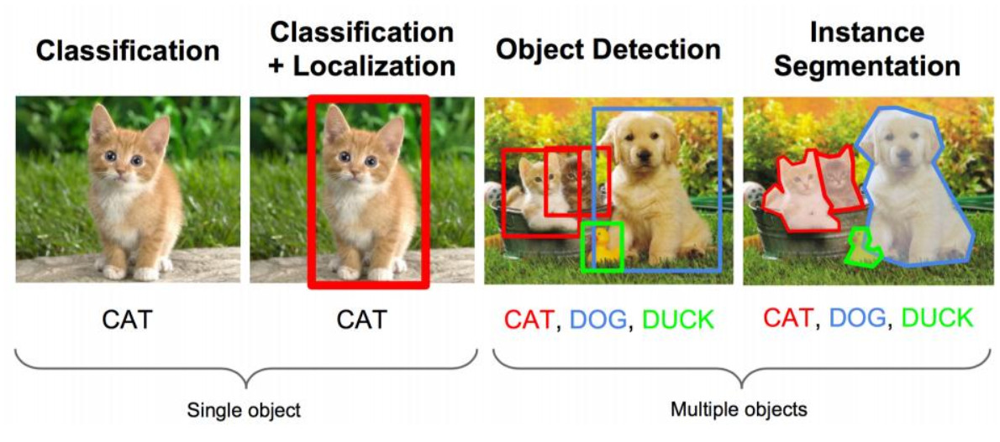
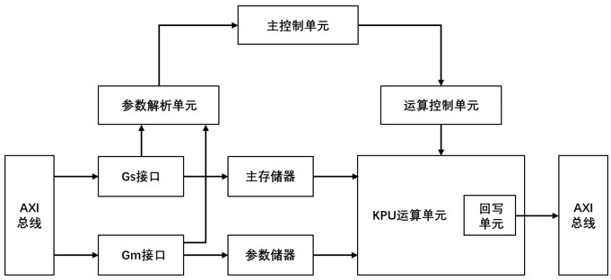
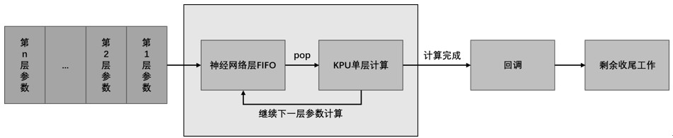
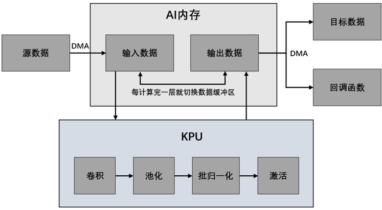
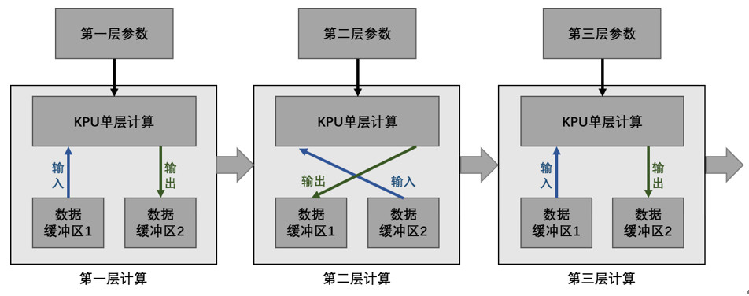

## 目标检测

大部分同学对图片分类都非常了解，就是算法对其中的对象进行分类。但目标检测问题，我们不仅要用算法判断图片中是不是一辆汽车， 还要在图片中标记出它的位置， 用边框或红色方框把汽车圈起来， 这就是目标检测问题。 其中“定位”的意思是判断汽车在图片中的具体位置。

如果你现在在看这篇文章，而且打算继续看下去，那么说明你对深度学习、神经网络和计算机视觉都有一定的了解，对其中的一些框架（如Tensorflow）有使用经验，并且打算利用K210这款进行目标检测或者其他计算机视觉任务。

计算机视觉和目标检测的内容非常庞大，足足写一本书，本文不会介绍过多的计算机视觉和目标检测内容，本文旨在提供一些案例，让开发者可以利用现有的模型，结合K210进行目标检测模型。

本文使用的神经网络模型是YOLOv2 tiny和YOLOv3 tiny。

以YOLOv3 tiny为例，如何从零开始训练自己的模型并将模型投入到K210中使用，可以参考这个链接/代码库：

>  https://github.com/zhen8838/K210_Yolo_framework

这个代码库作者提供了一套可使用的YOLOv3 tiny训练代码，使用Tensorflow框架。该代码库和文档从：训练数据处理->模型训练->模型测试->保存模型->

模型转换->案例，依次介绍了YOLOv3 tiny在K210上使用和部署的全过程。

本章的src/object_detection为开发板官方提供的YOLOv2-tiny的案例，该案例的解读可参考代码中的注解。接下来主要介绍K210中的KPU的工作原理。

KPU（Knowledge Processing Unit，知识处理单元）是K210通用神经网络处理器，其本质上是一个NPU（Neural-Network Processing Unit，神经网络处理单元）。KPU支持一些主流的深度网络框架（如Tensorflow、Caffe等）按照一些特定的限制规则训练出来的模型，这些模型需要定点化。KPU对深度网络的模型层数并没有固定的限制，可对卷积神经网络的每一层参数进行单独配置，其包括输入输出通道和行宽高，支持任意激活函数，仅支持1*1和3*3两种卷积核。处于实时工作状态的KPU支持神经网络的参数大小在5.5~5.9MB之间，非实时工作时最大支持网络参数大小如下表所示：

| 工况              | 最大定点模型大小  （MB） | 量化前浮点模型大小  （MB） |
| ----------------- | ------------------------ | -------------------------- |
| 实时（>=30帧/s）  | 5.9                      | 13.8                       |
| 非实时（<10帧/s） | 与Flash容量相关          | 与Flash容量相关            |

KPU的内部结构如下图所示，包括KPU运算单元、运算控制单元、主存储器、参数存储器和回写单元等：

KPU内置卷积、批归一化、激活、池化运算单元，可用于处理深度神经网络完成目标检测等任务，KPU的工作原理如下图所示：

KPU包含了一组卷积运算单元，可以构成一个神经网络的一层运算单元，并通过辅助控制单元（如运算控制单元、回写单元等），反复利用该层运算单元，从而实现一个多层神经网络的运算过程。其中，KUP的单层计算过程如下图所示：

对于中间层的计算过程，每一层的输出是下一层的输入，KPU采取了一种数据缓冲区切换的方式来轮流使用缓冲区，缓冲区切换过程如下图所示：

