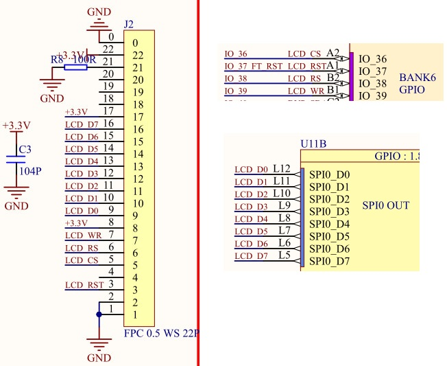
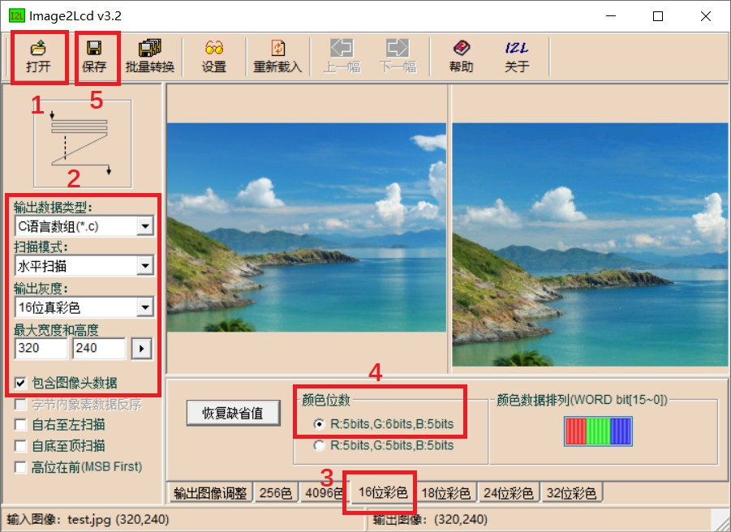
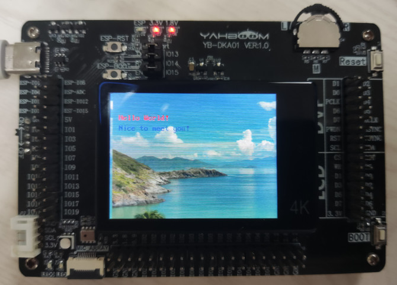

## LCD显示

本次实验代码在src/lcd中。

开发板上的LCD 显示屏为 2.0 寸，分辨率为 320*240，驱动芯片是 st7789，体积小，厚度薄，耗能低，工作电压为 3.3V，显示屏的材料为 TFT。

K210 开发板出厂默认已经安装好 LCD 显示屏，其中 LCD_D0~D7 总共八个引脚连接到 SPI0_D0~D7 上，LCD_CS 连接到 IO36 上，LCD_RST 连接到 IO37 上，LCD_RS连接 IO3 上，LCD_WR 连接 IO39 上：



LCD的驱动芯片是st7789，K210通过SPI总线协议来控制该芯片。

SPI 是一种高速、高效率的串行接口技术。通常由一个主模块和一个或多个从模块组成，主模块选择一个从模块进行同步通信，从而完成数据的交换。SPI
是一个环形结构，通信时需要至少 4 根线（事实上在单向传输时 3 根线也可以），它们是 MISO（主设备数据输入）、MOSI（主设备数据输出）、SCLK（时钟）、CS（片选）。

* MISO– Master Input Slave Output,主设备数据输入，从设备数据输出
* MOSI– Master Output Slave Input，主设备数据输出，从设备数据输入
* SCLK – Serial Clock，时钟信号，由主设备产生
* CS – Chip Select，从设备使能信号，由主设备控制。当有多个从设备的时候，因为每个从设备上都有一个片选引脚接入到主设备机中，当我们的主设备和某个从设备通信时将需要将从设备对应的片选引脚电平拉低或者是拉高

### 一、Image2Lcd工具介绍

如果要将图片显示到LCD中，还需要将图片转换为LCD相同的分辨率，最后将该图片转为二进制文件。通过上述方法，该图片可在LCD中显示。

这里介绍一个工具--Image3Lcd，工具在tool下可以找到，可通过如下几个步骤将tool/test.jpg转化为c语言代码：




打开图片最好转为320*240分辨率。最后保存的代码名字这里叫logo，其内容如下：

```c
const unsigned char gImage_logo[153608] = { 0X00,0X10,0X40,0X01,0XF0,0X00,0X01,0X1B,
0X97,0X2B,0X97,0X2B,0X97,0X2B,0X97,0X23,0X97,0X23,0X97,0X23,0X97,0X23,0X97,0X23,
0X97,0X23,0X97,0X23,0X97,0X23,0X97,0X23,0X97,0X23,0X97,0X23,0X97,0X23,0X97,0X23,
0X77,0X23,0X77,0X23,0X77,0X23,0X77,0X23,0X77,0X23,0X77,0X23,0X77,0X23,0X77,0X23,
0X97,0X23,0X97,0X23,0X77,0X23,0X77,0X23,0X77,0X23,0X77,0X23,0X77,0X23,0X77,0X23,
                                           ...
```

### 二、驱动介绍

st7789的驱动文件在st7789.h和st7789.c中，lcd.c和lcd.h调用了这两个文件，具体的内容和SPI库代码相关，感兴趣的同学可以自行结合st7789的数据手册对比研究，lcd.h提供了如下函数来支持向LCD屏幕写入字符串或者图片：

```c
void lcd_init(void);
void lcd_clear(uint16_t color);
void lcd_set_direction(lcd_dir_t dir);
void lcd_set_area(uint16_t x1, uint16_t y1, uint16_t x2, uint16_t y2);
void lcd_draw_point(uint16_t x, uint16_t y, uint16_t color);
void lcd_draw_string(uint16_t x, uint16_t y, char *str, uint16_t color);
void lcd_draw_picture(uint16_t x1, uint16_t y1, uint16_t width, uint16_t height, uint32_t *ptr);
void lcd_draw_rectangle(uint16_t x1, uint16_t y1, uint16_t x2, uint16_t y2, uint16_t width, uint16_t color);
void lcd_draw_picture_half(uint16_t x1, uint16_t y1, uint16_t width, uint16_t height, uint16_t *ptr);
void lcd_clear_all(void);
```

对于其中的具体内容，这里就不再深入研究，合适、必要时会解读一部分。

### 三、测试案例

本次实验将往LCD中显示一张图片和一些字符串。

首先是IO配置文件：

```c
#ifndef _PIN_CONFIG_H_
#define _PIN_CONFIG_H_
/*****************************HEAR-FILE************************************/
#include "fpioa.h"

/*****************************HARDWARE-PIN*********************************/
// 硬件IO口，与原理图对应
#define PIN_LCD_CS              (36)
#define PIN_LCD_RST             (37)
#define PIN_LCD_RS              (38)
#define PIN_LCD_WR              (39)

/*****************************SOFTWARE-GPIO********************************/
// 软件GPIO口，与程序对应
#define LCD_RST_GPIONUM         (0)
#define LCD_RS_GPIONUM          (1)

/*****************************FUNC-GPIO************************************/
// GPIO口的功能，绑定到硬件IO口
#define FUNC_LCD_CS             (FUNC_SPI0_SS3)
#define FUNC_LCD_RST            (FUNC_GPIOHS0 + LCD_RST_GPIONUM)
#define FUNC_LCD_RS             (FUNC_GPIOHS0 + LCD_RS_GPIONUM)
#define FUNC_LCD_WR             (FUNC_SPI0_SCLK)

#endif /* _PIN_CONFIG_H_ */
```

这里用到了SPI0。

接下来是硬件的初始化代码：

```c
void io_set_power(void)
{
    sysctl_set_power_mode(SYSCTL_POWER_BANK6, SYSCTL_POWER_V18);
}

void hardware_init(void)
{
    /**
    *PIN_LCD_CS	    36
    *PIN_LCD_RST	37
    *PIN_LCD_RS	    38
    *PIN_LCD_WR 	39
    **/
    fpioa_set_function(PIN_LCD_CS,  FUNC_LCD_CS);
    fpioa_set_function(PIN_LCD_RST, FUNC_LCD_RST);
    fpioa_set_function(PIN_LCD_RS,  FUNC_LCD_RS);
    fpioa_set_function(PIN_LCD_WR,  FUNC_LCD_WR);
    
    /* 使能SPI0和DVP数据 */
    sysctl_set_spi0_dvp_data(1);

}
```

需要注意的是，如果想让LCD正常工作，还需要通过io_set_power设置K210芯片的BANK6的IO口电压为1.8v，LCD处于BANK6中。

有了这些之后就可以向LCD中写入图片或者文字：

```c
/* 初始化LCD */
lcd_init();

/* 显示图片 */
lcd_draw_picture_half(0, 0, 320, 240, gImage_logo);
sleep(1);

/* 显示字符 */
lcd_draw_string(16, 40, "Hello World!", RED);
lcd_draw_string(16, 60, "Nice to meet you!", BLUE);

while (1);
```

首先调用lcd_init初始化LCD的显示模式：

```c
/* 初始化LCD，设置显示方向和启动显示 */
void lcd_init(void)
{
    uint8_t data = 0;
    /* 硬件初始化 */
    tft_hard_init();
    /* 重置LCD */
    tft_write_command(SOFTWARE_RESET);
    usleep(100000);
    /* 关闭睡眠模式 */
    tft_write_command(SLEEP_OFF);
    usleep(100000);
    /* 设置像素格式：65K, 16bit/pixel */
    tft_write_command(PIXEL_FORMAT_SET);
    data = 0x55;  /* 0101 0101*/
    tft_write_byte(&data, 1);
    /* 打开显示反转 */
    tft_write_command(INVERSION_DISPLAY_ON);
    /* 设置LCD显示方向 */
    lcd_set_direction(DIR_YX_LRUD);
    /* 使能显示 */
    tft_write_command(DISPLAY_ON);
    /* 清空显示 */
    lcd_clear(WHITE);
}
```

初始化LCD之后，调用lcd_draw_picture_half函数将第一章图片生成的c语言代码中的二进制图片数字gImage_logo显示到LCD中。最后调用lcd_draw_string函数向LCD中写入两行字符串。

通过如下命令编译烧写代码到开发板中：

```c
cmake .. -DPROJ=lcd -G "MinGW Makefiles"
make
kflash .\lcd.bin -p COM25 -b 1500000
```

开发板显示如下：



